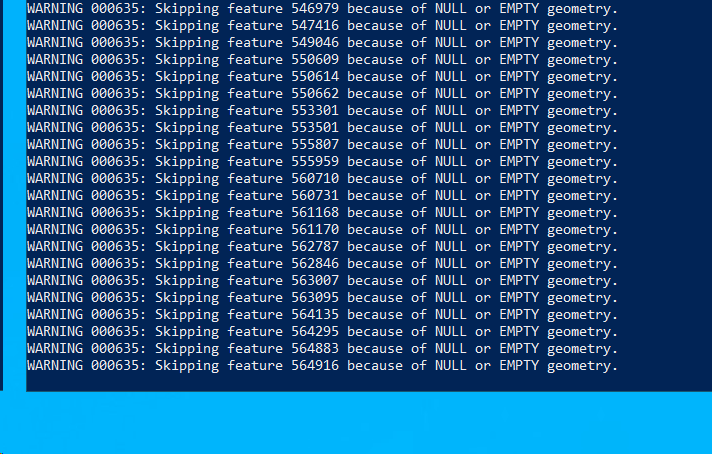

# EXECUTE NOW - Backfill Checklist (1 Hour 25 Minutes)

**File Located:** ✅ `CAD_ESRI_Polished_Baseline_20190101_20260203.xlsx` (76.1 MB)  
**Created:** Feb 3, 2026 at 4:31 PM  
**Status:** Clean, normalized, Phone/911 fixed, ready to deploy  
**Time Available:** 1 hour 25 minutes  

---

## COPY/PASTE COMMANDS - Execute in Order

### **STEP 1: Copy File to Server** (10 minutes)

**Option A: Automated Copy (if script exists)**

```powershell
# On LOCAL machine
cd "C:\Users\carucci_r\OneDrive - City of Hackensack\02_ETL_Scripts\cad_rms_data_quality\docs\arcgis"

# Check if copy script exists
Test-Path .\Copy-PolishedToServer.ps1

# If True, run it:
.\Copy-PolishedToServer.ps1

# If False, use Option B (manual)
```

**Option B: Manual Copy via RDP**

```powershell
# 1. Connect to HPD2022LAWSOFT via RDP

# 2. Open File Explorer on server

# 3. Copy this file from your local machine (via RDP shared clipboard):
#    Source (local): C:\Users\carucci_r\OneDrive - City of Hackensack\13_PROCESSED_DATA\ESRI_Polished\base\CAD_ESRI_Polished_Baseline_20190101_20260203.xlsx
#    
#    Destination (server): C:\HPD ESRI\03_Data\CAD\Backfill\CAD_Consolidated_2019_2026.xlsx
#
# 4. Verify copy on server:



# Should show: ~76-80 MB, today's date
```

---

### **STEP 2: Pre-Flight Checks** (5 minutes)

```powershell
# On SERVER (in RDP session)
cd "C:\HPD ESRI\04_Scripts"

# Run checks
.\Test-PublishReadiness.ps1
```

**Expected: All ✅ green checks**

**If any failures:**
- Lock file exists → Remove it: `Remove-Item "C:\HPD ESRI\03_Data\CAD\Backfill\_STAGING\_LOCK.txt" -Force`
- Task running → Wait 5 minutes
- ArcGIS Pro open → Close it

---

### **STEP 3: Dry Run Test** (5 minutes)

```powershell
# On SERVER
cd "C:\HPD ESRI\04_Scripts"

.\Invoke-CADBackfillPublish.ps1 -BackfillFile "C:\HPD ESRI\03_Data\CAD\Backfill\CAD_Consolidated_2019_2026.xlsx" -DryRun
```

**Expected: [SUCCESS] Dry run completed - ready for actual run**

**If errors:** Stop and troubleshoot. Don't proceed to Step 4.

---

### **STEP 4: ACTUAL BACKFILL PUBLISH** (40-60 minutes) ⏱️

**⚠️ STAY CONNECTED - Don't disconnect RDP during this step**

```powershell
# On SERVER
cd "C:\HPD ESRI\04_Scripts"

.\Invoke-CADBackfillPublish.ps1 -BackfillFile "C:\HPD ESRI\03_Data\CAD\Backfill\CAD_Consolidated_2019_2026.xlsx"
```

**What you'll see:**
```
[LIVE MODE]
[1] Loading configuration... [OK]
[2] Verifying files... [OK]
[3] Pre-flight checks... [OK]
[4] Creating lock file... [OK]
[5] Swapping backfill to staging... [OK]
[6] Running Publish Call Data tool...
    (This takes 40-60 minutes - BE PATIENT)
    ... progress messages ...
[7] Tool completed... [OK]
[8] Restoring default export... [OK]
[9] Cleanup... [OK]

[SUCCESS] Backfill publish completed
```

**Monitor for:**
- ✅ Progress messages every few minutes
- ✅ "Tool execution completed!" message
- ❌ Error messages (if any, let script finish for auto-restore)

---

### **STEP 5: Verify Dashboard** (5 minutes)

**A. Check Feature Service**

```
1. Open browser
2. Go to: ArcGIS Online
3. Content → CallsForService → Data tab
4. Verify "Last Modified" is TODAY
```

**B. Check Dashboard**

```
1. Open your CAD dashboard
2. Set date filter: 2019-01-01 to 2026-02-03
3. Check "Call Source" filter:
   ✅ Should show: Phone (separate)
   ✅ Should show: 9-1-1 (separate)
   ❌ Should NOT show: Phone/911 (combined)
```

**C. Spot Check Historical Data**

```
Filter to 2019 data:
- Should see records from 2019
- Phone and 9-1-1 should be separated (not combined)
```

---

### **STEP 6: Tonight's Automated Run** (No action needed)

**What happens automatically at 12:30 AM tonight:**

```
FileMaker exports → Copy to staging → Publish to dashboard
```

**Result:**
- Last 7 days (01/28 - 02/05) will be refreshed with today's data
- Overwrites the 7-day overlap (this is good!)
- Your clean historical data (2019 to 01/27) stays intact
```

---

## Quick Troubleshooting

### "Copy-PolishedToServer.ps1 not found"
**Solution:** Use Option B (manual copy via RDP)

### "Test-PublishReadiness.ps1 not found"
**Solution:** Check if scripts are in `C:\HPD ESRI\04_Scripts\` on server. If not, they may need to be copied from the repo first.

### "Invoke-CADBackfillPublish.ps1 not found"
**Solution:** Copy from repo:
```powershell
# From LOCAL machine, copy to server
Copy-Item "C:\Users\carucci_r\OneDrive - City of Hackensack\02_ETL_Scripts\cad_rms_data_quality\docs\arcgis\*.ps1" `
          "\\HPD2022LAWSOFT\c$\HPD ESRI\04_Scripts\" -Force
```

### "Upload takes >60 minutes"
**This is normal for large datasets** - Just wait. Network speed varies.

### "Connection drops during Step 4"
**Solution:**
```powershell
# Reconnect to RDP
# Check if still running:
Get-Content "C:\HPD ESRI\03_Data\CAD\Backfill\_STAGING\_LOCK.txt"

# Check latest log:
Get-ChildItem "C:\Temp\arcgis_scheduled_tasks" | Sort LastWriteTime -Descending | Select -First 1 | Get-Content -Tail 20
```

---

## Emergency Stop

**If you need to abort:**
```powershell
# Find the Python process
Get-Process | Where-Object {$_.ProcessName -like "*python*"}

# Kill it (only if truly stuck)
Stop-Process -Id <PID> -Force

# Script will auto-restore staging file in finally block
```

---

## Time Check

- **Started at:** [Your start time]
- **Expected finish:** [Start + 70 minutes]
- **Current time:** [Check periodically]

**If running low on time:**
- Step 4 (publish) is the only long step (40-60 min)
- If you start Step 4 and run out of time, you can disconnect - it will continue
- Check status when you reconnect

---

## SUCCESS = Dashboard Shows 2019-2026 Data with Phone/911 Fixed

**Verification queries for dashboard:**
- Date range: 2019 to 2026 ✅
- Call Source filter: Phone (separate) ✅
- Call Source filter: 9-1-1 (separate) ✅
- Call Source filter: Phone/911 (should NOT exist) ✅
- Historical records visible (filter to 2019, see data) ✅

---

**START HERE:** Run Step 1 now!

**Time remaining:** 1 hour 25 minutes ⏱️
