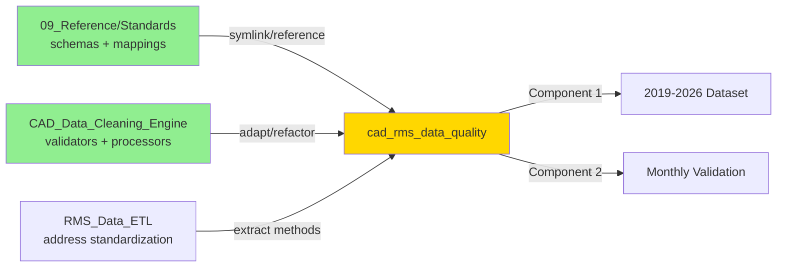
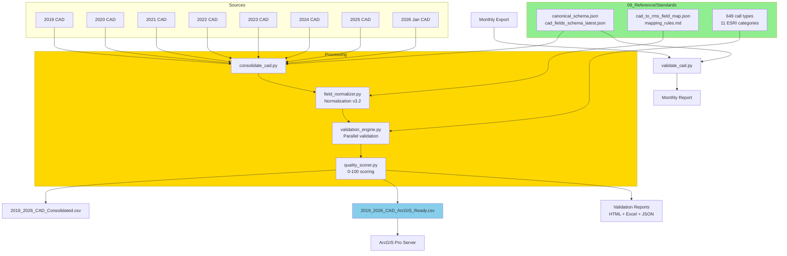

# CAD/RMS Data Quality System - Complete Redesign

## 🎯 Implementation Status Update (2026-02-05)

**Current (v1.3.4):** Backfill investigation underway. System stable, data ready (754K records, 99.97% quality), but ArcGIS publish hangs at feature 564916. Emergency restore mechanism verified. See **BACKFILL_INVESTIGATION_20260205.md** and **ORCHESTRATOR_SESSION_HANDOFF_20260205.md** for tonight's findings.

**Next Priority:** Test with smaller dataset (2024-2026, ~100K records) to isolate root cause, then implement batch processing or API upload as needed.

### ✅ Phase 1: Configuration & Scaffolding (COMPLETE)

**Completed Files:**
- `config/schemas.yaml` - Points to 09_Reference/Standards with variable expansion
- `config/validation_rules.yaml` - Validation patterns, quality scoring, domain values
- `config/consolidation_sources.yaml` - 2019-2026 CAD source file paths
- `requirements.txt` - Python dependencies (pandas, pyyaml, usaddress, rapidfuzz, etc.)
- `pyproject.toml` - Project metadata, entry points, test configuration
- `.gitignore` - Exclusions for outputs, logs, Python artifacts

**Documentation:**
- `outputs/consolidation/EXTRACTION_REPORT.txt` - Complete Python module extraction guide

### 🚧 Phase 2: Python Module Extraction (NEXT - See EXTRACTION_REPORT.txt)

**Ready for Extraction** (from chat transcripts in `docs/Claude-Data_cleaning_project_implementation_roadmap/`):
1. `shared/utils/schema_loader.py` (~500 lines) - chunk_00001.txt
2. `shared/processors/field_normalizer.py` (~1200 lines) - chunk_00003.txt
3. `shared/validators/validation_engine.py` (~1100 lines) - chunk_00006.txt
4. `shared/validators/quality_scorer.py` (~1000 lines) - chunks 00008/00009
5. `consolidation/scripts/consolidate_cad.py` (~800 lines) - chunk_00009.txt (finalized)
6. `run_consolidation.py` (~400 lines) - chunk_00010.txt
7. `Makefile` (~200 lines) - chunk_00010.txt

**Status:** Configuration layer complete. ~5000 lines of production-ready Python code designed and ready for extraction from chat chunks.

---

## Objective

Create a unified, production-ready data quality system that:

1. **Consolidates 2019-2026 CAD data** into single validated dataset for ArcGIS Pro
2. **Provides monthly validation** for ongoing CAD and RMS exports
3. **Establishes single source of truth** by archiving 3 legacy projects

## Authoritative Sources (Confirmed by User)

### Primary Logic Source

`**CAD_Data_Cleaning_Engine**` - Most up-to-date scripts and cleaning logic

- Location: `C:\Users\carucci_r\OneDrive - City of Hackensack\02_ETL_Scripts\CAD_Data_Cleaning_Engine`
- Status: Active (last updated Dec 2025)
- Contains: Production validation framework, normalization rules v3.2, parallel processing, RMS backfill

### Primary Schema/Standards Source

`**09_Reference/Standards**` - Authoritative data dictionaries and mappings

- Location: `C:\Users\carucci_r\OneDrive - City of Hackensack\09_Reference\Standards`
- Version: v2.3.0 (last updated Jan 17, 2026)
- Contains:
  - `[CAD/DataDictionary/current/schema/cad_export_field_definitions.md](C:/Users/carucci_r/OneDrive - City of Hackensack/09_Reference/Standards/CAD/DataDictionary/current/schema/cad_export_field_definitions.md)`
  - `[RMS/DataDictionary/current/schema/rms_export_field_definitions.md](C:/Users/carucci_r/OneDrive - City of Hackensack/09_Reference/Standards/RMS/DataDictionary/current/schema/rms_export_field_definitions.md)`
  - `[CAD_RMS/DataDictionary/current/schema/cad_to_rms_field_map.json](C:/Users/carucci_r/OneDrive - City of Hackensack/09_Reference/Standards/CAD_RMS/DataDictionary/current/schema/cad_to_rms_field_map.json)`
  - `[CAD_RMS/DataDictionary/current/schema/multi_column_matching_strategy.md](C:/Users/carucci_r/OneDrive - City of Hackensack/09_Reference/Standards/CAD_RMS/DataDictionary/current/schema/multi_column_matching_strategy.md)`
  - 649 call types mapped to 11 ESRI categories
  - NIBRS offense classifications

`**unified_data_dictionary**` - Canonical schemas and transformation specs

- Location: `C:\Users\carucci_r\OneDrive - City of Hackensack\09_Reference\Standards\unified_data_dictionary`
- Updated: Jan 16, 2026
- Contains:
  - `[schemas/canonical_schema.json](C:/Users/carucci_r/OneDrive - City of Hackensack/09_Reference/Standards/unified_data_dictionary/schemas/canonical_schema.json)` - Single source of truth
  - `[schemas/cad_fields_schema_latest.json](C:/Users/carucci_r/OneDrive - City of Hackensack/09_Reference/Standards/unified_data_dictionary/schemas/cad_fields_schema_latest.json)`
  - `[schemas/rms_fields_schema_latest.json](C:/Users/carucci_r/OneDrive - City of Hackensack/09_Reference/Standards/unified_data_dictionary/schemas/rms_fields_schema_latest.json)`
  - `[schemas/transformation_spec.json](C:/Users/carucci_r/OneDrive - City of Hackensack/09_Reference/Standards/unified_data_dictionary/schemas/transformation_spec.json)` - 8-stage ETL pipeline
  - `[mappings/mapping_rules.md](C:/Users/carucci_r/OneDrive - City of Hackensack/09_Reference/Standards/unified_data_dictionary/mappings/mapping_rules.md)`

### Legacy Projects to Review for Specific Features

- `dv_doj` - DV-specific patterns, may have useful reporting templates
- `RMS_Data_ETL` - Address standardization with `usaddress` library
- `RMS_Data_Processing` - Time artifact fixes
- ~~`RMS_CAD_Combined_ETL`~~ - Empty skeleton, skip entirely

## Architecture Decision: Reference vs. Copy




**Strategy**: New project will **reference** Standards schemas (not copy), and **adapt/refactor** CAD_Data_Cleaning_Engine logic.

## New Project Structure

**Location**: `C:\Users\carucci_r\OneDrive - City of Hackensack\02_ETL_Scripts\cad_rms_data_quality\`

```
cad_rms_data_quality/
├── README.md
├── requirements.txt (from CAD_Data_Cleaning_Engine + usaddress)
├── pyproject.toml
├── Makefile
├── .gitignore
│
├── config/
│   ├── schemas.yaml                 # Points to 09_Reference/Standards paths
│   ├── validation_rules.yaml        # From CAD_Data_Cleaning_Engine
│   └── consolidation_sources.yaml   # 2019-2026 file paths
│
├── consolidation/                   # Component 1: Historical
│   ├── scripts/
│   │   ├── consolidate_cad.py      # Merges 2019-2026 CAD files
│   │   └── prepare_arcgis.py       # Creates ArcGIS-ready output
│   ├── output/
│   │   └── 2019_2026_CAD_ArcGIS_Ready.csv
│   └── reports/
│       ├── consolidation_report.html
│       └── gap_analysis.xlsx
│
├── monthly_validation/              # Component 2: Ongoing
│   ├── scripts/
│   │   ├── validate_cad.py         # Monthly CAD validator
│   │   └── validate_rms.py         # Monthly RMS validator
│   ├── templates/
│   │   └── validation_report_template.html
│   └── reports/
│       └── YYYY_MM_DD_validation/
│
├── shared/                          # Refactored from CAD_Data_Cleaning_Engine
│   ├── validators/
│   │   ├── validation_engine.py    # From CAD_Data_Cleaning_Engine
│   │   ├── pre_run_checks.py       # From validation_harness.py
│   │   ├── post_run_checks.py      # From validate_full_pipeline.py
│   │   ├── address_validator.py    # From RMS_Data_ETL (usaddress)
│   │   ├── case_number_validator.py
│   │   └── quality_scorer.py       # 0-100 scoring
│   ├── processors/
│   │   ├── field_normalizer.py     # Advanced Normalization v3.2
│   │   ├── datetime_processor.py   # Time artifact fixes
│   │   └── address_standardizer.py # USPS standardization
│   ├── reporting/
│   │   ├── html_generator.py
│   │   ├── excel_generator.py
│   │   └── json_generator.py
│   └── utils/
│       ├── schema_loader.py        # Loads from 09_Reference/Standards
│       ├── hash_utils.py           # File integrity checks
│       └── audit_trail.py          # Change tracking
│
├── tests/
│   ├── test_validators.py
│   ├── test_processors.py
│   ├── test_consolidation.py
│   └── fixtures/
│
└── docs/
    ├── ARCHITECTURE.md
    ├── MIGRATION_NOTES.md          # What came from where
    ├── CONSOLIDATION_GUIDE.md
    ├── MONTHLY_VALIDATION_GUIDE.md
    └── STANDARDS_REFERENCE.md      # How to use 09_Reference/Standards
```

## Implementation Plan

### Phase 1: Project Setup & Schema Integration ✅ COMPLETE (2026-01-30)

**✅ Create project structure**:
- ✅ Initialized `cad_rms_data_quality/` directory with all required folders
- ✅ Created `requirements.txt` (pandas, numpy, pyyaml, usaddress, rapidfuzz, openpyxl, jinja2, pytest, ruff, mypy)
- ✅ Created `pyproject.toml` with project metadata and build configuration
- ✅ Created `.gitignore` with exclusions for outputs, logs, Python artifacts
- ✅ Created `config/schemas.yaml` with paths to 09_Reference/Standards schemas (with ${variable} expansion)

**✅ Schema configuration**:
- ✅ Created `config/schemas.yaml` pointing to 09_Reference/Standards
  - Paths to canonical_schema.json, cad_fields_schema_latest.json, rms_fields_schema_latest.json
  - Field mappings (cad_to_rms, rms_to_cad, mapping_rules.md)
  - Call types (649 types mapped to 11 ESRI categories)
  - Response time filters configuration

**✅ Validation configuration**:
- ✅ Created `config/validation_rules.yaml` with:
  - Case number format validation (^\d{2}-\d{6}([A-Z])?$)
  - Required fields by data source (CAD/RMS)
  - Address validation settings (USPS, reverse geocoding, fuzzy matching ≥90%)
  - Domain validation for HowReported and Disposition
  - Quality scoring weights (Required: 30, Formats: 25, Address: 20, Domain: 15, Consistency: 10)
  - Anomaly detection thresholds
  - Response time calculation exclusions

**✅ Source file configuration**:
- ✅ Created `config/consolidation_sources.yaml` with:
  - 2019-2025 CAD file paths (7 yearly files)
  - Actual verified record counts per year (714K total, verified 2026-01-30)
  - Output file names and locations
  - Report configuration (HTML, Excel, JSON)
  - Logging configuration
  - Processing options (dedup field, chunk size, datetime fields)
  - Validation thresholds (min quality: 95, max dup rate: 1%)

**🔜 Schema loader utility** (Ready for extraction):
- Implementation complete in `docs/Claude-Data_cleaning_project_implementation_roadmap/chunk_00001.txt`
- Create `shared/utils/schema_loader.py` with:
  - `ConfigLoader` class with YAML loading and ${variable} expansion
  - `load_schema(schema_key)` - Load JSON schemas from Standards
  - `load_mapping(mapping_key)` - Load mappings (supports globs)
  - `validate_all_paths()` - Verify all referenced files exist
  - Convenience functions: `load_config()`, `load_schema()`, `validate_paths()`
  - CLI support: `python -m shared.utils.schema_loader`

**Key schemas reference** (from 09_Reference/Standards):
- `canonical_schema.json` - Master field definitions
- `cad_fields_schema_latest.json` - CAD field validation
- `rms_fields_schema_latest.json` - RMS field validation
- `cad_to_rms_field_map.json` - Cross-system mapping
- `transformation_spec.json` - 8-stage ETL pipeline spec

---

### Phase 2: Refactor CAD_Data_Cleaning_Engine Logic 🚧 READY FOR EXTRACTION

**Extract validation framework**:

- Copy `validators/validation_harness.py` → `shared/validators/pre_run_checks.py`
- Copy `validators/validate_full_pipeline.py` → `shared/validators/post_run_checks.py`
- Refactor to use schema_loader for field definitions

**Extract normalization**:

- Extract normalization logic from `enhanced_esri_output_generator.py`
- Create `shared/processors/field_normalizer.py` with Advanced Normalization Rules v3.2:
  - Concatenated value handling ("DispersedComplete" → "Dispersed")
  - Pattern-based normalization (HowReported: "R" → "Radio")
  - Default assignment for 100% domain compliance

**Extract parallel validation**:

- Adapt `validate_cad_export_parallel.py` → `shared/validators/validation_engine.py`
- Preserve vectorized operations for 26.7x performance gain

**Extract RMS backfill**:

- Adapt `scripts/unified_rms_backfill.py` for use in monthly validation
- Quality-scored record selection
- Intelligent deduplication

### Phase 3: Add Address Standardization from RMS_Data_ETL

**Extract from `RMS_Data_ETL/rms_core_cleaner.py**`:

- `standardize_address()` → `shared/processors/address_standardizer.py`
- Integrate `usaddress` library
- USPS pattern validation
- Reverse geocoding validation (if ArcGIS available)
- Fuzzy matching logic (90% threshold)

**Create address validator**:

- Multi-layer validation (USPS + reverse geocoding + fuzzy match)
- Quality flags: `bad_address_flag`, `address_validation_match`, `usps_validation`

### Phase 4: Build Component 1 - Historical Consolidation

**Script**: `consolidation/scripts/consolidate_cad.py`

**Data sources** (from previous discovery):

1. 2019: `05_EXPORTS\_CAD\full_year\2019\raw\2019_ALL_CAD.xlsx`
2. 2020: `05_EXPORTS\_CAD\full_year\2020\raw\2020_ALL_CAD.xlsx`
3. 2021: `05_EXPORTS\_CAD\full_year\2021\raw\2021_ALL_CAD.xlsx`
4. 2022: `05_EXPORTS\_CAD\full_year\2022\raw\2022_CAD_ALL.xlsx`
5. 2023: `05_EXPORTS\_CAD\full_year\2023\raw\2023_CAD_ALL.xlsx`
6. 2024: `05_EXPORTS\_CAD\full_year\2024\raw\2024_CAD_ALL.xlsx`
7. 2025: `05_EXPORTS\_CAD\full_year\2025\raw\2025_Yearly_CAD.xlsx`
8. 2026: `05_EXPORTS\_CAD\monthly_export\2026\2026_01_01_to_2026_01_28_CAD.xlsx`

**Processing logic**:

- Load each year using schema from `cad_fields_schema_latest.json`
- Normalize column names using field_normalizer
- Validate using validation_engine
- Apply Advanced Normalization Rules v3.2
- Deduplicate based on `ReportNumberNew`
- Gap detection (missing days or low-count days)
- Quality scoring (0-100)
- Audit trail with file hashes

**Output**: `2019_2025_CAD_Consolidated.csv` (714K records, ~543K unique cases after deduplication)

**Note**: Actual records are ~3.3x initial estimates due to inclusion of supplemental reports, unit records, and status updates (not just incident reports).

**Script**: `consolidation/scripts/prepare_arcgis.py`

**ArcGIS optimization**:

- Use canonical_schema.json field definitions
- Standardize addresses for geocoding
- Format datetime for time-enabled features
- Add derived fields (Year, Month, DayOfWeek, TimeOfDay)
- Export as `2019_2026_CAD_ArcGIS_Ready.csv`

**Reports**:

- HTML: `consolidation_report.html` (summary, quality score, issues by category)
- Excel: `gap_analysis.xlsx` (missing date ranges, low-count days)
- JSON: `consolidation_metrics.json` (machine-readable stats)

### Phase 5: Build Component 2 - Monthly Validation

**Script**: `monthly_validation/scripts/validate_cad.py`

**CLI**:

```bash
python monthly_validation/scripts/validate_cad.py \
  --input "05_EXPORTS\_CAD\monthly_export\2026\2026_02_CAD.xlsx" \
  --output "monthly_validation/reports/2026_02_01_cad/"
```

**Validation workflow**:

1. Pre-run checks (environment, dependencies, file exists)
2. Load CAD file with schema validation
3. Run validation_engine (field validation, pattern matching, quality scoring)
4. Compare against historical averages (detect anomalies)
5. Generate validation report (HTML + Excel + JSON)
6. Post-run checks (verify outputs created)

**Validation rules** (from 09_Reference/Standards):

- Case number format: `^\d{2}-\d{6}([A-Z])?$`
- Address validation: USPS + reverse geocoding + fuzzy match
- Required fields: `ReportNumberNew`, `Incident`, `TimeOfCall`, `FullAddress2`, `PDZone`
- Call type validation: Against 649 call types in 11 ESRI categories
- Disposition validation: Controlled vocabulary
- HowReported validation: 9-1-1, Phone, Walk-In, Self-Initiated, Radio, etc.

**Script**: `monthly_validation/scripts/validate_rms.py`

**Similar workflow for RMS** using:

- `rms_fields_schema_latest.json`
- `rms_export_field_definitions.md`
- Multi-column matching strategy for CAD↔RMS cross-validation

**Reports**:

- Pass/fail summary
- Issue counts by category (Critical/Warning/Info)
- Top 20 errors
- Data quality score
- Comparison to historical averages
- Recommended actions

### Phase 6: Testing & Documentation

**Tests**:

- Unit tests for validators, processors, schema_loader
- Integration tests for consolidation workflow
- End-to-end test with sample data

**Documentation**:

- `ARCHITECTURE.md` - System design, data flow diagrams
- `MIGRATION_NOTES.md` - What came from CAD_Data_Cleaning_Engine, RMS_Data_ETL, etc.
- `CONSOLIDATION_GUIDE.md` - How to run historical consolidation
- `MONTHLY_VALIDATION_GUIDE.md` - How to automate monthly validation
- `STANDARDS_REFERENCE.md` - How to use 09_Reference/Standards schemas

### Phase 7: Archive Legacy Projects

**Create archive**:

- Create `_ARCHIVED_2026_01_30/` in `02_ETL_Scripts/`
- Move these projects:
  - ~~`RMS_CAD_Combined_ETL`~~ (empty skeleton)
  - `RMS_Data_ETL` (extracted address standardization)
  - `RMS_Data_Processing` (extracted time artifact fixes)
- **Keep** `CAD_Data_Cleaning_Engine` (still useful as reference, may have other active uses)
- **Keep** `dv_doj` (active DV analysis project)

**Document migration**:

- Create `MIGRATION_NOTES.md` explaining:
  - What was extracted from each legacy project
  - Why CAD_Data_Cleaning_Engine was kept
  - Where to find migrated functionality in new project

## Key Validation Rules (from Standards)

### Case Number Validation

- Pattern: `^\d{2}-\d{6}([A-Z])?$`
- Example: `25-000001`, `25-000001A`
- Must be non-null, preserved as text

### Address Validation

- USPS standardization using `usaddress` library
- Reverse geocoding validation (if ArcGIS available)
- Fuzzy matching (≥90% threshold)
- Flag incomplete addresses (no street number, invalid format)
- Police HQ exclusion: "225 State Street"

### Call Type Validation

- 649 call types mapped to 11 ESRI categories
- Source: `09_Reference/Standards/mappings/call_types_*.csv`
- Categories: Criminal Incidents, Emergency Response, Traffic, etc.

### Quality Scoring (0-100)

- Required fields present: 30 points
- Valid formats: 25 points
- Address quality: 20 points
- Domain compliance: 15 points
- Consistency checks: 10 points

## Data Flow




## Success Criteria

### Component 1: Consolidation

- Single CSV with 714,689 records (2019-2025, all CAD events)
- ~543,000 unique cases after deduplication
- Quality score ≥95/100
- Gap analysis identifies missing days
- ArcGIS-ready dataset with standardized fields
- Comprehensive validation report

### Component 2: Monthly Validation

- CLI tools for CAD and RMS validation
- Reports generated in <5 minutes
- Pass/fail criteria with actionable recommendations
- Anomaly detection (vs. historical averages)

### Architecture

- All schemas referenced from 09_Reference/Standards (not duplicated)
- CAD_Data_Cleaning_Engine logic refactored and improved
- Address standardization from RMS_Data_ETL integrated
- 3 legacy projects archived with migration notes

## Post-Implementation

1. **Upload to ArcGIS**: Use `2019_2026_CAD_ArcGIS_Ready.csv`
2. **Review validation reports**: Address critical issues
3. **Backfill gaps**: Request missing data from CAD provider if needed
4. **Test dashboard**: Verify ArcGIS Pro model works with consolidated data
5. **Automate monthly validation**: Schedule via Windows Task Scheduler
6. **Transition to nightly**: Switch ArcGIS to nightly exports once stable

