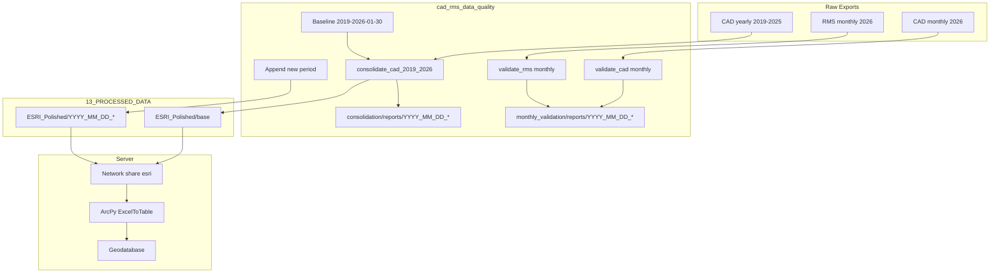

# CAD/RMS Data Quality: Baseline, Paths, Monthly Processing, Archive, and Server Handoff

## Context Summary

- **Current state**: Clean dataset 2019-01-01 through 2026-01-30 (724,794 records) produced by consolidate_cad_2019_2026.py; CSV written to CAD_Data_Cleaning_Engine `data/01_raw`, ESRI polished output to `data/03_final`. Quality reports and summaries live in outputs/consolidation/ (flat). copy_consolidated_dataset_to_server.ps1 copies a fixed path to `\\10.0.0.157\esri\`.
- **Legacy projects**: CAD_Data_Cleaning_Engine (ESRI generator, parallel validation, RMS backfill), Combined_CAD_RMS (CAD+RMS merge, PowerBI/Excel outputs), RMS_CAD_Combined_ETL (skeleton), RMS_Data_ETL (address/usaddress, quality JSON), RMS_Data_Processing (enhanced RMS, time fixes, quality reports).
- **ArcGIS handoff**: Gemini handoff package contains Inject/Restore PowerShell scripts and a full **arcpy** `ExcelToTable` import script (with verification); paths use `C:\HPD ESRI\03_Data\...` on server.

---

## 1. Baseline dataset and faster incremental processing

**1.1 Save current polished dataset as baseline**

- **Action**: Copy the current "complete through 2026-01-30" polished file into the new canonical location (see section 2) as the **base** version (e.g. `ESRI_Polished/base/CAD_ESRI_Polished_Baseline_20190101_20260130.xlsx` or equivalent naming you choose). Treat this as the immutable starting point; future runs only **append** new date ranges.
- **Config**: Add a `baseline` section to config/consolidation_sources.yaml (or a small `paths.yaml`) with: path to the baseline polished file; date range (2019-01-01, 2026-01-30) and record count (724,794) for validation.
- **Script**: Either a one-time copy script or a step in the consolidation workflow that, when "building from baseline," checks for this base file and uses it instead of re-processing 2019–2026 from scratch.

**1.2 Speed up processing (cores and chunking)**

- **Consolidation (consolidate_cad_2019_2026.py)**: Currently loads each Excel file sequentially with `pd.read_excel`. Options: (a) keep sequential load but add **chunked read** for very large workbooks (`openpyxl` read_only + chunking, or `pd.read_excel(..., chunksize)` if available), or (b) load files in **parallel** (e.g. `concurrent.futures`) to use more cores during I/O. Concatenation and date filtering are already vectorized; no change needed there.
- **ESRI generation (CAD_Data_Cleaning_Engine)**: enhanced_esri_output_generator.py already has `n_workers`, `enable_parallel`, and chunked normalization (e.g. `chunk_size = max(10000, len(df) // n_workers)`). Expose or default higher worker count and ensure the consolidation pipeline passes `--workers` (or config) when calling it.
- **Incremental append path**: For "append only" runs (e.g. 2026-02-01 onward): Load **baseline** polished table once (or last YYYY_MM_DD_ appended file). Load only **new** monthly CAD (and RMS if needed) for the new period. Concatenate, deduplicate by ReportNumberNew (+ timestamp if needed), then run ESRI generator only on the **combined** dataset (or run ESRI only on new chunk and merge with existing polished if schema allows). This avoids re-reading 7 years of CSVs/Excel and reduces runtime significantly.
- **Recommendation**: Implement "baseline + incremental" mode in config (e.g. `use_baseline: true`, `baseline_path: ...`) and a small wrapper or flags in consolidate_cad_2019_2026.py / backfill script so full run vs append is explicit.

---

## 2. New directory for clean/polished data: 13_PROCESSED_DATA

**2.1 Structure**

- **Root**: `C:\Users\carucci_r\OneDrive - City of Hackensack\13_PROCESSED_DATA\ESRI_Polished\`
- **Base (starting point)**: `ESRI_Polished\base\` — one file: the 2019-01-01 to 2026-01-30 polished dataset (recommended: "base" = single canonical starting point). Alternative: `ESRI_Polished\main\` — same idea, name preference only.
- **Appended versions**: `ESRI_Polished\YYYY_MM_DD_<description>\` (e.g. `2026_02_15_CAD_ESRI_Polished.xlsx` or a subfolder per run). Use a **prefix** `YYYY_MM_DD_` for the folder and/or filename so runs are sortable and auditable.
- **Config**: Add to config/consolidation_sources.yaml (or a dedicated paths config): `processed_data_root`, `esri_polished_base_dir`, `esri_polished_appended_dir` with naming convention `YYYY_MM_DD_*`.

**2.2 Script changes**

- Point consolidation/ESRI output step to write: **Base** once into `ESRI_Polished\base\` (baseline); **Appended** each run into `ESRI_Polished\YYYY_MM_DD_<run>\` (or a single file `YYYY_MM_DD_CAD_ESRI_Polished.xlsx` in one folder).
- Update copy_consolidated_dataset_to_server.ps1 to use "most recent" polished file under `13_PROCESSED_DATA\ESRI_Polished` (e.g. latest by date in filename or folder name) instead of a hardcoded path.

---

## 3. Quality reports under consolidation/reports with YYYY_MM_DD_

**3.1 Layout**

- **Current**: outputs/consolidation/ contains many flat .txt/.json/.md reports.
- **Target**: Keep reports **inside the repo**, under **consolidation**: `consolidation/reports/YYYY_MM_DD_<run_id>/` — e.g. `consolidation/reports/2026_02_01_consolidation/` or `2026_02_01_full/`. Each run writes its quality reports, summary, and any JSON/HTML into that date-prefixed folder.

**3.2 Implementation**

- Create `consolidation/reports/` and add a `.gitkeep` (or leave contents; decide if reports are gitignored or committed).
- In consolidate_cad_2019_2026.py: replace the current `outputs/consolidation/consolidation_summary.txt` path with a run-specific directory, e.g. `consolidation/reports/YYYY_MM_DD_consolidation/consolidation_summary.txt`, and write all run outputs (summary, validation results, etc.) there.
- Optional: Add a `consolidation/reports/latest` symlink or a small `latest_run.txt` that stores the last run's folder name for scripts that need "latest report."
- **Migration**: One-time move or copy of existing outputs/consolidation/ content into something like `consolidation/reports/2026_01_30_legacy/` so history is preserved; then document that new reports go only under `consolidation/reports/YYYY_MM_DD_*`.

---

## 4. Monthly CAD and RMS processing directories and reports

**4.1 Raw inputs (already specified)**

- **CAD**: `C:\Users\carucci_r\OneDrive - City of Hackensack\05_EXPORTS\_CAD\monthly\2026`
- **RMS**: `C:\Users\carucci_r\OneDrive - City of Hackensack\05_EXPORTS\_RMS\monthly\2026`

**4.2 Directories in repo**

- **Monthly processing root**: monthly_validation/ (already in README / Claude.md). Inputs: config-only references to the above paths. Outputs: `monthly_validation/processed/` or `monthly_validation/output/` (e.g. by run date: YYYY_MM_DD_cad/, YYYY_MM_DD_rms/); `monthly_validation/reports/YYYY_MM_DD_cad/` and `monthly_validation/reports/YYYY_MM_DD_rms/` — one folder per run per source.
- **Config**: Extend config/rms_sources.yaml and consolidation/CAD config to include `monthly_cad_directory`, `monthly_rms_directory`, and output paths for processed data and reports (under monthly_validation/).

**4.3 Report content (robust and exhaustive)**

- **Overall quality**: Score (0–100), record count, date range, completeness %, domain compliance %.
- **Breakdown**: Missing required fields (counts and which fields); non-normalized / incorrect values (per domain: HowReported, Disposition, Incident, etc.) with counts and sample bad values; invalid formats (case number, dates, times) with counts and examples.
- **Action items**: Table or list of "records to manually correct": row identifier (e.g. ReportNumberNew + timestamp), field, current value, suggested correction or rule violated, priority if applicable. Export as CSV/Excel so another office can apply fixes.
- **Implementation**: Add or extend scripts under monthly_validation/scripts/ (e.g. validate_cad.py, validate_rms.py) to read from config monthly paths, run validation (reuse shared/ validators and quality scoring when present), and write the above into monthly_validation/reports/YYYY_MM_DD_cad/ and .../YYYY_MM_DD_rms/ (HTML summary + JSON + action-items CSV/Excel).

---

## 5. Legacy project review and archive

**5.1 Projects to review**

- **CAD_Data_Cleaning_Engine**: ESRI output, validation, RMS backfill — enhanced_esri_output_generator.py (chunked/parallel), validate_esri_polished_dataset.py, validate_cad_export_parallel.py, unified_rms_backfill.py, processors/.
- **Combined_CAD_RMS**: CAD+RMS merge, PowerBI/Excel — cad_rms_combiner.py, comprehensive_pipeline.py, FINAL_CLEAN_V3, pipeline_enhanced_*.
- **RMS_CAD_Combined_ETL**: Skeleton — config, integrate_rms_cad.py, run_integration.py.
- **RMS_Data_ETL**: RMS cleaning, address — usaddress, quality JSON, ARCGIS/CONDA docs.
- **RMS_Data_Processing**: Enhanced RMS, time fixes — enhanced_rms_processor_*, quality_report.json, 02_Cleaned_Data, 04_Final_Output.

**5.2 What to bring into cad_rms_data_quality**

- **CAD_Data_Cleaning_Engine**: Either keep calling as external step or copy/integrate ESRI generator and key validators into this repo (e.g. under shared/ or consolidation/scripts/). Document dependency clearly.
- **Combined_CAD_RMS / RMS_CAD_Combined_ETL**: Add a design or script that consumes polished CAD + cleaned RMS and produces one enriched dataset; implement using existing combiner logic as reference.
- **RMS_Data_ETL**: Address standardization (usaddress) — add to shared/processors/ or monthly validation pipeline.
- **RMS_Data_Processing**: Time artifact fixes and enhanced RMS — align with shared processors and monthly validation.

**5.3 Archive**

- **When**: After baseline and paths are in place, monthly validation and reports run from cad_rms_data_quality, and server copy + arcpy workflow are in place.
- **Where**: `C:\Users\carucci_r\OneDrive - City of Hackensack\02_ETL_Scripts\_Archive\`
- **How**: Move (or copy then delete) each project into _Archive\CAD_Data_Cleaning_Engine, _Archive\Combined_CAD_RMS, etc. Add a short _Archive\README.md listing what each folder is and that cad_rms_data_quality is the active project.
- **C:\Dev\HCPD_DataPipeline**: If that repo exists, review for unique enrichment logic and document or port into cad_rms_data_quality, then archive if appropriate.

---

## 6. Server copy of latest polished file and ArcGIS Pro arcpy script

**6.1 Copy most recent polished file to server**

- **Source**: "Most recent" polished file from `13_PROCESSED_DATA\ESRI_Polished` (base or latest YYYY_MM_DD_* run). Resolve by listing that directory and choosing latest by date (folder or filename).
- **Destination**: Keep current behavior: copy to `\\10.0.0.157\esri\` (and optionally a friendly name e.g. CAD_Consolidated_2019_2026.xlsx).
- **Script**: Update copy_consolidated_dataset_to_server.ps1 to read config or a single "output base" path (e.g. 13_PROCESSED_DATA\ESRI_Polished), find latest file (by name date or last-write time), copy to server share; log path and record count in a small run log if desired.

**6.2 ArcPy script for ArcGIS Pro**

- **Source**: Use the script from the Gemini handoff (chunk_00000 / chunk_00001): KB_Shared 2026_02_01 Gemini ArcGIS handoff.
- **Content**: arcpy.conversion.ExcelToTable with: Input Excel path (e.g. C:\HPD ESRI\03_Data\CAD\CAD_Consolidated_2019_2026.xlsx on server); Output default project geodatabase, table name e.g. CAD_Consolidated_2019_2026; Verification: GetCount, optional Min/Max on TimeOfCall, column count check.
- **Deliverable**: Add a file in this repo, e.g. docs/arcgis/import_cad_polished_to_geodatabase.py, containing the full runnable arcpy script (with config block at top for paths and expected count 724,794 or parameterized). Optionally a one-page docs/arcgis/README.md with run location, order of operations (copy to server → run script), and link to REMOTE_SERVER_GUIDE.md.

---

## Implementation order (suggested)

1. **Paths and baseline**: Add 13_PROCESSED_DATA\ESRI_Polished\base (and optional appended structure). Copy current 2026-01-30 polished file to base; add config entries.
2. **Reports**: Create consolidation/reports/ and YYYY_MM_DD_ folder logic; point consolidate_cad_2019_2026.py and any quality writers there. Optionally migrate outputs/consolidation into a legacy report folder.
3. **Server + ArcPy**: Update copy_consolidated_dataset_to_server.ps1 to use latest from ESRI_Polished. Add import_cad_polished_to_geodatabase.py and short docs/arcgis README.
4. **Monthly processing**: Add monthly_validation dirs and config; implement or wire validate_cad/validate_rms to monthly paths and write reports (including action items).
5. **Speed**: Add baseline + incremental mode; optional parallel load or chunked read in consolidation; ensure ESRI generator worker count is configurable.
6. **Legacy**: After everything runs from cad_rms_data_quality, move the five projects (and HCPD_DataPipeline if applicable) to _Archive and document.

---

## Diagram (high-level)

