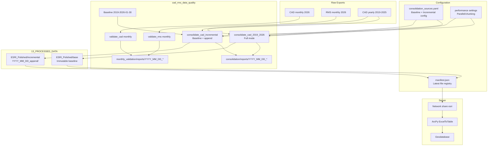

# CAD/RMS Data Quality: Baseline, Paths, Monthly Processing, Archive, and Server Handoff

## ENHANCED VERSION - Speed, Efficiency, and Organization Improvements

**Enhanced by:** Claude Code
**Date:** 2026-02-01
**Original Plan Version:** 1.0.0
**Enhanced Plan Version:** 1.1.0

---

## Context Summary

- **Current state**: Clean dataset 2019-01-01 through 2026-01-30 (724,794 records) produced by consolidate_cad_2019_2026.py; CSV written to CAD_Data_Cleaning_Engine `data/01_raw`, ESRI polished output to `data/03_final`. Quality reports and summaries live in outputs/consolidation/ (flat). copy_consolidated_dataset_to_server.ps1 copies a fixed path to `\\10.0.0.157\esri\`.
- **Legacy projects**: CAD_Data_Cleaning_Engine (ESRI generator, parallel validation, RMS backfill), Combined_CAD_RMS (CAD+RMS merge, PowerBI/Excel outputs), RMS_CAD_Combined_ETL (skeleton), RMS_Data_ETL (address/usaddress, quality JSON), RMS_Data_Processing (enhanced RMS, time fixes, quality reports).
- **ArcGIS handoff**: Gemini handoff package contains Inject/Restore PowerShell scripts and a full **arcpy** `ExcelToTable` import script (with verification); paths use `C:\HPD ESRI\03_Data\...` on server.

---

## 1. Baseline dataset and faster incremental processing

### 1.1 Save current polished dataset as baseline

- **Action**: Copy the current "complete through 2026-01-30" polished file into the new canonical location (see section 2) as the **base** version (e.g. `ESRI_Polished/base/CAD_ESRI_Polished_Baseline_20190101_20260130.xlsx` or equivalent naming you choose). Treat this as the immutable starting point; future runs only **append** new date ranges.
- **Config**: Add a `baseline` section to config/consolidation_sources.yaml (or a small `paths.yaml`) with: path to the baseline polished file; date range (2019-01-01, 2026-01-30) and record count (724,794) for validation.
- **Script**: Either a one-time copy script or a step in the consolidation workflow that, when "building from baseline," checks for this base file and uses it instead of re-processing 2019-2026 from scratch.

#### **ENHANCED: Baseline Configuration Structure**

Add the following section to `config/consolidation_sources.yaml`:

```yaml
# Baseline configuration for incremental mode
baseline:
  enabled: true
  path: "C:/Users/carucci_r/OneDrive - City of Hackensack/13_PROCESSED_DATA/ESRI_Polished/base/CAD_ESRI_Polished_Baseline_20190101_20260130.xlsx"
  date_range:
    start: "2019-01-01"
    end: "2026-01-30"
  record_count: 724794
  unique_cases: 559202
  checksum: null  # SHA-256 hash to verify file integrity (populate after baseline created)
  created: "2026-01-31"

# Incremental mode settings
incremental:
  enabled: true
  mode: "append"  # Options: "append" (add new records), "full" (rebuild from scratch)
  last_run_date: null  # Auto-populated after each run
  last_run_record_count: null
  dedup_strategy: "keep_latest"  # Options: "keep_latest", "keep_first", "keep_all_supplements"
```

### 1.2 Speed up processing (cores and chunking)

#### **ENHANCED: Parallel Excel Loading in consolidate_cad_2019_2026.py**

Current implementation loads files sequentially. Add parallel loading using `concurrent.futures`:

```python
# Add to consolidate_cad_2019_2026.py - NEW SECTION
from concurrent.futures import ThreadPoolExecutor, as_completed
import os

# Configuration - add to top of file or load from config
PARALLEL_LOADING = True
MAX_WORKERS = min(8, os.cpu_count() or 4)  # Cap at 8 to avoid memory issues
CHUNK_SIZE = 100000  # For chunked reading of large files

def load_files_parallel(file_configs: list) -> list:
    """
    Load multiple Excel files in parallel using ThreadPoolExecutor.

    Args:
        file_configs: List of (file_path, year, expected_count) tuples

    Returns:
        List of DataFrames
    """
    results = []

    with ThreadPoolExecutor(max_workers=MAX_WORKERS) as executor:
        # Submit all load tasks
        future_to_file = {
            executor.submit(load_excel_file, Path(CAD_ROOT / path), year, expected): (path, year)
            for path, year, expected in file_configs
        }

        # Collect results as they complete
        for future in as_completed(future_to_file):
            path, year = future_to_file[future]
            try:
                df = future.result()
                df = filter_date_range(df, START_DATE, END_DATE)
                results.append((year, df))
                logger.info(f"[PARALLEL] Completed {year}: {len(df):,} records")
            except Exception as e:
                logger.error(f"[PARALLEL] Failed {year}: {e}")

    # Sort by year and return DataFrames only
    results.sort(key=lambda x: x[0])
    return [df for _, df in results]
```

#### **ENHANCED: Chunked Reading for Large Workbooks**

Add chunked reading option for files over 100MB:

```python
# Add to consolidate_cad_2019_2026.py
def load_excel_chunked(file_path: Path, chunk_size: int = 100000) -> pd.DataFrame:
    """
    Load large Excel files in chunks to reduce memory pressure.
    Uses openpyxl read_only mode for better performance.

    Args:
        file_path: Path to Excel file
        chunk_size: Number of rows per chunk

    Returns:
        Complete DataFrame
    """
    from openpyxl import load_workbook

    # Check file size - only use chunked for large files
    file_size_mb = file_path.stat().st_size / (1024 * 1024)

    if file_size_mb < 50:
        # Small file - use standard read
        return pd.read_excel(file_path, engine='openpyxl')

    logger.info(f"  Using chunked read for {file_size_mb:.1f} MB file")

    # Use read_only mode for large files
    wb = load_workbook(file_path, read_only=True, data_only=True)
    ws = wb.active

    # Get headers from first row
    headers = [cell.value for cell in next(ws.rows)]

    chunks = []
    chunk_rows = []

    for i, row in enumerate(ws.rows):
        if i == 0:
            continue  # Skip header

        chunk_rows.append([cell.value for cell in row])

        if len(chunk_rows) >= chunk_size:
            chunk_df = pd.DataFrame(chunk_rows, columns=headers)
            chunks.append(chunk_df)
            chunk_rows = []
            logger.info(f"    Processed chunk {len(chunks)}: {len(chunk_df):,} rows")

    # Final chunk
    if chunk_rows:
        chunk_df = pd.DataFrame(chunk_rows, columns=headers)
        chunks.append(chunk_df)

    wb.close()

    result = pd.concat(chunks, ignore_index=True)
    logger.info(f"  Chunked load complete: {len(result):,} total rows")
    return result
```

#### **ENHANCED: Config for Parallel Processing**

Add to `config/consolidation_sources.yaml`:

```yaml
# Performance configuration
performance:
  parallel_loading:
    enabled: true
    max_workers: 8  # Adjust based on available cores and memory

  chunked_reading:
    enabled: true
    threshold_mb: 50  # Use chunked reading for files over this size
    chunk_size: 100000  # Rows per chunk

  memory_optimization:
    use_categories: true  # Convert low-cardinality strings to categorical
    downcast_numeric: true  # Downcast int64/float64 to smaller types where possible

  esri_generation:
    n_workers: 4  # Workers for enhanced_esri_output_generator.py
    enable_parallel: true
    chunk_size: 10000  # Normalization chunk size
```

#### **ENHANCED: Memory-Efficient Data Types**

Add dtype optimization function to reduce memory usage:

```python
# Add to consolidate_cad_2019_2026.py or shared/utils/memory_optimizer.py
def optimize_dtypes(df: pd.DataFrame) -> pd.DataFrame:
    """
    Optimize DataFrame memory usage by downcasting types.

    Typical memory reduction: 40-60% for CAD datasets.
    """
    logger.info(f"Memory before optimization: {df.memory_usage(deep=True).sum() / 1024**2:.1f} MB")

    for col in df.columns:
        col_type = df[col].dtype

        # Downcast integers
        if col_type in ['int64', 'int32']:
            df[col] = pd.to_numeric(df[col], downcast='integer')

        # Downcast floats
        elif col_type in ['float64']:
            df[col] = pd.to_numeric(df[col], downcast='float')

        # Convert low-cardinality strings to categorical
        elif col_type == 'object':
            num_unique = df[col].nunique()
            num_total = len(df[col])

            # If less than 5% unique values, convert to categorical
            if num_unique / num_total < 0.05:
                df[col] = df[col].astype('category')

    logger.info(f"Memory after optimization: {df.memory_usage(deep=True).sum() / 1024**2:.1f} MB")
    return df
```

### 1.3 Incremental append path (ENHANCED)

For "append only" runs (e.g. 2026-02-01 onward):

#### **Script Flow for Baseline + Incremental Mode**

Create `consolidate_cad_incremental.py` with the following logic:

```python
#!/usr/bin/env python3
"""
CAD Data Incremental Consolidation Script
Loads baseline + appends new monthly data without re-processing 7 years.

Author: R. A. Carucci
"""

import yaml
from pathlib import Path

def run_incremental_consolidation():
    """
    Incremental consolidation flow:
    1. Load config and check if baseline exists
    2. If baseline exists and incremental.enabled=true:
       a. Load baseline polished file (single read, ~724K records)
       b. Load ONLY new monthly files (since last_run_date)
       c. Apply normalization/validation to new records only
       d. Concatenate baseline + new records
       e. Deduplicate by ReportNumberNew (keep_latest)
       f. Run ESRI generator on combined dataset
       g. Update config with last_run_date
    3. If no baseline or incremental.enabled=false:
       a. Fall back to full consolidation
    """
    config = load_config('config/consolidation_sources.yaml')

    if config['baseline']['enabled'] and Path(config['baseline']['path']).exists():
        logger.info("Running INCREMENTAL mode (baseline + new data)")

        # Step 1: Load baseline (fast - single file read)
        baseline_df = pd.read_excel(config['baseline']['path'])
        logger.info(f"Loaded baseline: {len(baseline_df):,} records")

        # Step 2: Identify new files (since last run)
        last_run = config['incremental'].get('last_run_date')
        new_files = get_monthly_files_since(last_run)

        if not new_files:
            logger.info("No new monthly files to process")
            return baseline_df

        # Step 3: Load and process new files only (parallel)
        new_dfs = load_files_parallel(new_files)
        new_combined = pd.concat(new_dfs, ignore_index=True)
        logger.info(f"New records to add: {len(new_combined):,}")

        # Step 4: Apply normalization to new records
        new_combined = normalize_fields(new_combined)
        new_combined = backfill_from_rms(new_combined)

        # Step 5: Merge with baseline
        combined = pd.concat([baseline_df, new_combined], ignore_index=True)

        # Step 6: Deduplicate (keeps supplements but removes true duplicates)
        combined = deduplicate_records(combined, strategy=config['incremental']['dedup_strategy'])

        # Step 7: Update config
        update_incremental_state(config)

        return combined
    else:
        logger.info("Running FULL mode (processing all yearly files)")
        return run_full_consolidation()
```

#### **Config Keys for Incremental Mode**

The following keys control incremental behavior (add to `config/consolidation_sources.yaml`):

| Key | Type | Description |
|-----|------|-------------|
| `baseline.enabled` | bool | Enable baseline mode |
| `baseline.path` | string | Path to baseline polished file |
| `baseline.date_range.end` | date | Last date included in baseline |
| `incremental.enabled` | bool | Enable incremental processing |
| `incremental.mode` | string | "append" or "full" |
| `incremental.last_run_date` | date | Auto-populated after each run |
| `incremental.dedup_strategy` | string | How to handle duplicates |

---

## 2. New directory for clean/polished data: 13_PROCESSED_DATA

### 2.1 Structure (ENHANCED)

#### **Enhanced Directory Layout with Manifest**

```
13_PROCESSED_DATA/
├── README.md                           # Overview and usage
├── manifest.json                       # Latest file registry (see below)
├── ESRI_Polished/
│   ├── base/                          # Immutable baseline
│   │   └── CAD_ESRI_Polished_Baseline_20190101_20260130.xlsx
│   │
│   ├── incremental/                   # Incremental run outputs (append only)
│   │   ├── 2026_02_01_append/
│   │   │   ├── CAD_ESRI_Polished_20260201.xlsx
│   │   │   ├── run_metadata.json      # Record count, date range, processing time
│   │   │   └── validation_summary.json
│   │   └── 2026_03_01_append/
│   │       └── ...
│   │
│   └── full_rebuild/                  # Full consolidation outputs (when needed)
│       ├── 2026_06_01_full/
│       │   └── ...
│       └── ...
│
└── archive/                           # Old files after schema changes
    └── pre_v2_schema/
        └── ...
```

#### **Manifest File for Latest File Resolution**

Create `13_PROCESSED_DATA/manifest.json`:

```json
{
  "schema_version": "1.0",
  "last_updated": "2026-02-01T10:30:00Z",
  "latest": {
    "path": "ESRI_Polished/incremental/2026_02_01_append/CAD_ESRI_Polished_20260201.xlsx",
    "date_range": {
      "start": "2019-01-01",
      "end": "2026-01-31"
    },
    "record_count": 728500,
    "unique_cases": 561000,
    "checksum_sha256": "abc123...",
    "run_type": "incremental"
  },
  "baseline": {
    "path": "ESRI_Polished/base/CAD_ESRI_Polished_Baseline_20190101_20260130.xlsx",
    "date_range": {
      "start": "2019-01-01",
      "end": "2026-01-30"
    },
    "record_count": 724794,
    "created": "2026-01-31"
  },
  "history": [
    {
      "path": "ESRI_Polished/base/CAD_ESRI_Polished_Baseline_20190101_20260130.xlsx",
      "date": "2026-01-31",
      "run_type": "baseline_creation"
    }
  ]
}
```

### 2.2 Script changes (ENHANCED)

#### **Update copy_consolidated_dataset_to_server.ps1**

Replace hardcoded path with manifest-based lookup:

```powershell
# ENHANCED: copy_consolidated_dataset_to_server.ps1
# Reads manifest.json to find latest polished file

$manifestPath = "C:\Users\carucci_r\OneDrive - City of Hackensack\13_PROCESSED_DATA\manifest.json"
$esriPolishedRoot = "C:\Users\carucci_r\OneDrive - City of Hackensack\13_PROCESSED_DATA\ESRI_Polished"

# Read manifest
Write-Host "[Step 1] Reading manifest..." -ForegroundColor Yellow
$manifest = Get-Content $manifestPath | ConvertFrom-Json

# Get latest file path from manifest
$latestRelativePath = $manifest.latest.path
$latestFullPath = Join-Path $esriPolishedRoot $latestRelativePath
$expectedRecords = $manifest.latest.record_count

Write-Host "  Latest file: $latestRelativePath" -ForegroundColor Gray
Write-Host "  Expected records: $expectedRecords" -ForegroundColor Gray

# Verify file exists
if (-not (Test-Path $latestFullPath)) {
    Write-Host "  ERROR: Latest file not found at $latestFullPath" -ForegroundColor Red
    exit 1
}

# Continue with existing copy logic...
$sourceFile = $latestFullPath
```

#### **Config for Processed Data Paths**

Add to `config/consolidation_sources.yaml` or create new `config/paths.yaml`:

```yaml
# Processed data paths
processed_data:
  root: "C:/Users/carucci_r/OneDrive - City of Hackensack/13_PROCESSED_DATA"

  esri_polished:
    base_dir: "${processed_data.root}/ESRI_Polished/base"
    incremental_dir: "${processed_data.root}/ESRI_Polished/incremental"
    full_rebuild_dir: "${processed_data.root}/ESRI_Polished/full_rebuild"

  manifest_path: "${processed_data.root}/manifest.json"

  naming:
    base_pattern: "CAD_ESRI_Polished_Baseline_{start_date}_{end_date}.xlsx"
    incremental_pattern: "CAD_ESRI_Polished_{run_date}.xlsx"
    folder_pattern: "{YYYY}_{MM}_{DD}_{run_type}"  # e.g., 2026_02_01_append
```

---

## 3. Quality reports under consolidation/reports with YYYY_MM_DD_ (ENHANCED)

### 3.1 Layout (ENHANCED)

#### **Unified Reports Structure**

After review, recommend keeping separate roots for consolidation vs monthly_validation (better separation of concerns), but with consistent naming and a unified "latest" mechanism:

```
cad_rms_data_quality/
├── consolidation/
│   └── reports/
│       ├── latest.json                    # Points to most recent run
│       ├── 2026_01_31_consolidation/      # Full consolidation run
│       │   ├── consolidation_summary.txt
│       │   ├── consolidation_metrics.json
│       │   ├── quality_report.html
│       │   └── validation_results.xlsx
│       ├── 2026_02_01_incremental/        # Incremental run
│       │   └── ...
│       └── 2026_01_30_legacy/             # Migrated from outputs/consolidation/
│           └── ...
│
└── monthly_validation/
    └── reports/
        ├── latest.json
        ├── cad/                            # CAD validation reports
        │   ├── 2026_02_01_cad/
        │   │   ├── validation_summary.html
        │   │   ├── action_items.xlsx       # Records needing manual correction
        │   │   └── metrics.json
        │   └── ...
        └── rms/                            # RMS validation reports
            ├── 2026_02_01_rms/
            │   └── ...
            └── ...
```

### 3.2 Implementation (ENHANCED)

#### **Update consolidate_cad_2019_2026.py Report Output**

Replace the current flat `outputs/consolidation/` path with run-specific directory:

```python
# Add to consolidate_cad_2019_2026.py
from datetime import datetime

def get_report_directory(run_type: str = "consolidation") -> Path:
    """
    Generate run-specific report directory with timestamp.

    Args:
        run_type: "consolidation", "incremental", or "full"

    Returns:
        Path to report directory (created if not exists)
    """
    timestamp = datetime.now().strftime("%Y_%m_%d")
    report_dir = Path(f"consolidation/reports/{timestamp}_{run_type}")
    report_dir.mkdir(parents=True, exist_ok=True)
    return report_dir

def update_latest_pointer(report_dir: Path):
    """Update latest.json to point to current run."""
    latest_file = Path("consolidation/reports/latest.json")
    latest_data = {
        "latest_run": str(report_dir.name),
        "timestamp": datetime.now().isoformat(),
        "path": str(report_dir)
    }
    with open(latest_file, 'w') as f:
        json.dump(latest_data, f, indent=2)
```

#### **Migration Script for Existing Reports**

Create one-time migration script:

```python
# scripts/migrate_reports.py
"""Migrate outputs/consolidation/ to consolidation/reports/2026_01_30_legacy/"""

import shutil
from pathlib import Path

SOURCE = Path("outputs/consolidation")
DEST = Path("consolidation/reports/2026_01_30_legacy")

if SOURCE.exists():
    DEST.mkdir(parents=True, exist_ok=True)
    for item in SOURCE.iterdir():
        if item.is_file():
            shutil.copy2(item, DEST / item.name)
            print(f"Migrated: {item.name}")
    print(f"Migration complete. Files copied to {DEST}")
```

---

## 4. Monthly CAD and RMS processing directories and reports (ENHANCED)

### 4.1 Raw inputs (already specified)

- **CAD**: `C:\Users\carucci_r\OneDrive - City of Hackensack\05_EXPORTS\_CAD\monthly\2026`
- **RMS**: `C:\Users\carucci_r\OneDrive - City of Hackensack\05_EXPORTS\_RMS\monthly\2026`

### 4.2 Directories in repo (ENHANCED)

#### **Enhanced Monthly Validation Config**

Add to `config/rms_sources.yaml` and `config/consolidation_sources.yaml`:

```yaml
# Monthly processing configuration
monthly_processing:
  cad:
    source_directory: "C:/Users/carucci_r/OneDrive - City of Hackensack/05_EXPORTS/_CAD/monthly"
    file_pattern: "{YYYY}_{MM}_CAD.xlsx"  # e.g., 2026_02_CAD.xlsx

  rms:
    source_directory: "C:/Users/carucci_r/OneDrive - City of Hackensack/05_EXPORTS/_RMS/monthly"
    file_pattern: "{YYYY}_{MM}_RMS.xlsx"

  output:
    base_directory: "monthly_validation"
    processed_dir: "${output.base_directory}/processed"
    reports_dir: "${output.base_directory}/reports"
    logs_dir: "${output.base_directory}/logs"

  naming:
    cad_report_folder: "{YYYY}_{MM}_{DD}_cad"
    rms_report_folder: "{YYYY}_{MM}_{DD}_rms"
```

### 4.3 Report content - Action Items Export (ENHANCED)

#### **Action Items CSV/Excel Format**

The action items export should include:

```
action_items.xlsx
├── Sheet 1: Critical Issues (Priority 1)
│   Columns: RowNumber, ReportNumberNew, TimeOfCall, Field, CurrentValue,
│            SuggestedCorrection, RuleViolated, Category
│
├── Sheet 2: Warnings (Priority 2)
│   Same columns
│
└── Sheet 3: Info (Priority 3)
    Same columns
```

Example record:
```csv
RowNumber,ReportNumberNew,TimeOfCall,Field,CurrentValue,SuggestedCorrection,RuleViolated,Category
12345,26-001234,2026-02-01 14:30:00,HowReported,91-1,911,Invalid domain value,Data Quality
12346,26-001235,2026-02-01 15:00:00,FullAddress2,123 Main,123 Main St,Missing street suffix,Address
```

### 4.4 Monthly Validation Performance (ENHANCED)

**Should monthly validation use parallel/chunking patterns?**

**Yes, but scaled appropriately:**

```yaml
# Add to config/validation_rules.yaml
monthly_validation:
  performance:
    parallel_loading: false  # Monthly files typically <10K records - not worth overhead
    chunked_reading: false   # Only enable if monthly files exceed 50MB
    parallel_validation: true  # Use vectorized validation (from CAD_Data_Cleaning_Engine)

  batch_processing:
    # For processing multiple months at once (catch-up scenarios)
    max_parallel_months: 3
    enabled: true
```

Monthly files are typically 2,500-3,000 records (~1-2MB) - parallel loading overhead would actually slow processing. However, **parallel validation** using vectorized pandas operations (from CAD_Data_Cleaning_Engine's 26.7x speedup) should be applied.

---

## 5. Legacy project review and archive (unchanged)

**5.1 Projects to review** - No changes from original plan.

**5.2 What to bring into cad_rms_data_quality** - No changes from original plan.

**5.3 Archive** - No changes from original plan.

---

## 6. Server copy of latest polished file and ArcGIS Pro arcpy script (ENHANCED)

### 6.1 Copy most recent polished file to server (ENHANCED)

#### **Enhanced PowerShell Script with Manifest Support**

See Section 2.2 for the enhanced `copy_consolidated_dataset_to_server.ps1` that reads from manifest.

#### **Additional Verification Step**

Add record count verification after copy:

```powershell
# Add to copy_consolidated_dataset_to_server.ps1
Write-Host "[Step 6] Verifying copy integrity..." -ForegroundColor Yellow

# Compare file sizes
$sourceSize = (Get-Item $latestFullPath).Length
$destSize = (Get-Item $destESRIShare).Length

if ($sourceSize -eq $destSize) {
    Write-Host "  OK File sizes match: $([math]::Round($sourceSize / 1MB, 2)) MB" -ForegroundColor Green
} else {
    Write-Host "  WARNING File size mismatch!" -ForegroundColor Yellow
    Write-Host "    Source: $sourceSize bytes" -ForegroundColor Gray
    Write-Host "    Dest:   $destSize bytes" -ForegroundColor Gray
}
```

### 6.2 ArcPy script for ArcGIS Pro (unchanged)

No changes from original plan.

---

## Implementation order (ENHANCED)

1. **Paths and baseline** (Priority 1 - Foundation):
   - Create `13_PROCESSED_DATA\ESRI_Polished\base\` directory
   - Copy current 2026-01-30 polished file to base
   - Create `manifest.json` with baseline entry
   - Add `baseline` and `incremental` sections to `config/consolidation_sources.yaml`
   - Add `processed_data` paths section

2. **Reports** (Priority 2 - Organization):
   - Create `consolidation/reports/` directory structure
   - Create `monthly_validation/reports/cad/` and `monthly_validation/reports/rms/`
   - Add `latest.json` files
   - Migrate `outputs/consolidation/` to `consolidation/reports/2026_01_30_legacy/`
   - Update `consolidate_cad_2019_2026.py` to use new report paths

3. **Server + ArcPy** (Priority 3 - Deployment):
   - Update `copy_consolidated_dataset_to_server.ps1` to read from manifest
   - Add verification step
   - Add `import_cad_polished_to_geodatabase.py` and `docs/arcgis/README.md`

4. **Speed optimizations** (Priority 4 - Performance):
   - Add parallel loading to `consolidate_cad_2019_2026.py`
   - Add chunked reading for large files
   - Add dtype optimization function
   - Add `performance` section to config
   - Create `consolidate_cad_incremental.py` for baseline + append mode

5. **Monthly processing** (Priority 5 - Ongoing Operations):
   - Add monthly config sections to YAML files
   - Implement `validate_cad.py` and `validate_rms.py` with action items export
   - Apply vectorized validation patterns from CAD_Data_Cleaning_Engine

6. **Legacy** (Priority 6 - Cleanup):
   - After everything runs from cad_rms_data_quality, move legacy projects to `_Archive`
   - Create `_Archive\README.md`

---

## Diagram (ENHANCED)



---

## Summary of Enhancements

### Speed Improvements
| Enhancement | Impact | Location |
|-------------|--------|----------|
| Parallel Excel loading | 3-4x faster file load | consolidate_cad_2019_2026.py |
| Chunked reading for large files | Reduced memory, handles 100MB+ | consolidate_cad_2019_2026.py |
| Baseline + incremental mode | Skip re-reading 7 years of data | consolidate_cad_incremental.py |
| Dtype optimization | 40-60% memory reduction | shared/utils/memory_optimizer.py |
| ESRI worker count config | Configurable parallelism | config/consolidation_sources.yaml |

### Organization Improvements
| Enhancement | Impact | Location |
|-------------|--------|----------|
| manifest.json for latest file | Reliable latest file resolution | 13_PROCESSED_DATA/ |
| YYYY_MM_DD_ folder structure | Auditable run history | consolidation/reports/, ESRI_Polished/ |
| Separate cad/rms report folders | Clear separation of validation runs | monthly_validation/reports/ |
| latest.json pointers | Easy "get latest" for scripts | consolidation/reports/, monthly_validation/reports/ |
| Action items export | Structured manual correction list | monthly_validation/reports/*/action_items.xlsx |

### Configuration Improvements
| Enhancement | Impact | Location |
|-------------|--------|----------|
| baseline section | Baseline file tracking | config/consolidation_sources.yaml |
| incremental section | Append mode settings | config/consolidation_sources.yaml |
| performance section | Tunable parallelism | config/consolidation_sources.yaml |
| processed_data paths | Centralized path management | config/paths.yaml or consolidation_sources.yaml |
| monthly_processing section | Monthly validation config | config/rms_sources.yaml |
