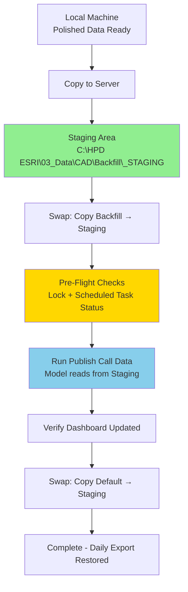

# Streamlined CAD Data Backfill & Dashboard Update Process

## Current State Problems

Based on your experience, the current workflow suffers from:

1. **5+ hour manual process** with multiple RDP connections and manual interventions
2. **PowerShell copy failures** from local machine to server
3. **ArcPy script errors** when running in ArcGIS Pro Python window
4. **Manual model node source switching** in ArcGIS Pro (most time-consuming)
5. **Disjointed verification** - unclear which scripts/reports to run and where to save them
6. **IT directory changes** requiring pipeline reconnection (moved to `C:\HPD ESRI`)
7. **Lack of collision control** with the scheduled midnight publish job

## ⚠️ CRITICAL: Run Discovery Script First

**STOP** - Before implementing any scripts, you MUST run the tool discovery script to find the exact Python callable name for your "Publish Call Data" tool.

### Why This Is Critical

1. **Tool name mismatch**: The tool display name ("Publish Call Data") is different from the Python callable name (e.g., `TransformCallData_tbx1`)
2. **Wrong callable = script failure**: If we hardcode the wrong name, the orchestrator will fail
3. **Output dataset unknown**: We need to see the geoprocessing messages to know what feature class the tool creates/updates

### Discovery Process

**Step 1:** Copy the discovery script to the server:

```powershell
# On your local machine
Copy-Item `
    "C:\Users\carucci_r\OneDrive - City of Hackensack\02_ETL_Scripts\cad_rms_data_quality\docs\arcgis\discover_tool_info.py" `
    "\\HPD2022LAWSOFT\c$\HPD ESRI\04_Scripts\discover_tool_info.py"
```

**Step 2:** On the server, run the discovery:

```powershell
# Via RDP on HPD2022LAWSOFT
cd "C:\HPD ESRI\04_Scripts"

# Create output directory if it doesn't exist
New-Item -ItemType Directory -Path "_out" -Force

# Run discovery using ArcGIS Pro Python
& "C:\Program Files\ArcGIS\Pro\bin\Python\Scripts\propy.bat" discover_tool_info.py

# Review results
Get-Content "_out\tool_discovery.json" | ConvertFrom-Json | Format-List
```

**Step 3:** Paste the `tool_discovery.json` contents back into this planning session so we can:

- Update `config.json` with the correct tool name
- Create the `run_publish_call_data.py` script with the correct callable
- Finalize all configuration values

**DO NOT PROCEED** with script implementation until discovery is complete.

---

## Solution Architecture

### Core Strategy: Staging File Pattern

**The Problem:** Currently you edit the ModelBuilder `Publish Call Data` tool's "Input Spreadsheet" path each time you backfill (pointing it to the backfill file, then back to the default).

**The Solution:** Configure the model ONCE to point to a fixed staging path. Then only swap the file content at that location.




### Directory Structure on Server (C:\HPD ESRI)

```
C:\HPD ESRI\
├── LawEnforcementDataManagement_New\
│   ├── LawEnforcementDataManagement.aprx   # ArcGIS Pro project
│   └── LawEnforcementDataManagement.atbx   # Toolbox with TransformCallData_tbx1
├── 03_Data\
│   └── CAD\
│       ├── Backfill\
│       │   ├── _STAGING\                   # NEW - Fixed staging location
│       │   │   ├── ESRI_CADExport.xlsx     # Model always reads THIS file
│       │   │   └── _LOCK.txt               # Collision prevention
│       │   ├── CAD_Consolidated_2019_2026.xlsx # Your polished backfill data
│       │   └── 2025_12_CAD_Data.xlsx           # Prior backfill example
│       └── CAD_Data.gdb\                       # Target geodatabase
└── 04_Scripts\                                 # NEW - Organized automation scripts
    ├── Invoke-CADBackfillPublish.ps1           # Main orchestrator
    ├── Get-HPD_ESRI_PublishContext.ps1         # Environment checker
    ├── Copy-PolishedToServer.ps1               # Copy from local → server
    ├── Test-PublishReadiness.ps1               # Pre-flight checks
    ├── _out\                                   # Script outputs & logs
    │   ├── publish_context.json
    │   └── backfill_YYYYMMDD_HHMMSS.log
    └── _verification\                          # Verification reports
        └── dashboard_test_YYYYMMDD.html
```

## One-Time Setup Changes

### 1. Create Staging Directory Structure

On the server (`C:\HPD ESRI`), run:

```powershell
# Create staging folder
New-Item -ItemType Directory -Path "C:\HPD ESRI\03_Data\CAD\Backfill\_STAGING" -Force

# Create scripts folders
New-Item -ItemType Directory -Path "C:\HPD ESRI\04_Scripts\_out" -Force
New-Item -ItemType Directory -Path "C:\HPD ESRI\04_Scripts\_verification" -Force

# Initialize staging with default export (COPY, don't move)
Copy-Item `
    "C:\Program Files\FileMaker\FileMaker Server\Data\Documents\ESRI\ESRI_CADExport.xlsx" `
    "C:\HPD ESRI\03_Data\CAD\Backfill\_STAGING\ESRI_CADExport.xlsx"
```

### 2. Update ArcGIS Pro Model (ONE TIME)

**VERIFY THE ACTUAL PROJECT PATH FIRST:**

Check which path exists on the server:

**CONFIRMED PATH:** `C:\HPD ESRI\LawEnforcementDataManagement_New\LawEnforcementDataManagement.aprx`

Open this file in ArcGIS Pro:

1. Open **ModelBuilder** (or **Geoprocessing** pane) and locate the `Publish Call Data` tool
2. Note the **toolbox path** (e.g., `LawEnforcementDataManagement.atbx` or similar)
3. Find the **Input Spreadsheet** parameter in the tool
4. Change path from:
  ```
   C:\Program Files\FileMaker\FileMaker Server\Data\Documents\ESRI\ESRI_CADExport.xlsx
  ```
   to:
5. Save the model/toolbox
6. **Test:** Run the tool manually once to verify it reads from staging correctly

**Result:** You never have to edit the model path again. The model always reads from `_STAGING\ESRI_CADExport.xlsx`. The scheduled task handles refreshing that file daily.

### 3. Discover Tool Callable Name and Output Dataset

**CRITICAL:** Before implementing scripts, we need to discover the exact Python callable name for your tool.

**On the server, create and run this discovery script:**

`C:\HPD ESRI\04_Scripts\discover_tool_info.py`

```python
"""
Tool Discovery Script
Purpose: Find the exact Python callable name and output dataset for Publish Call Data tool
Run: Using ArcGIS Pro Python environment
"""
import arcpy
import json
from pathlib import Path

# Configuration
TOOLBOX_PATH = r"C:\HPD ESRI\LawEnforcementDataManagement_New\LawEnforcementDataManagement.atbx"
TOOLBOX_ALIAS = "tbx1"
OUTPUT_JSON = r"C:\HPD ESRI\04_Scripts\_out\tool_discovery.json"

print("=" * 60)
print("TOOL DISCOVERY SCRIPT")
print("=" * 60)

results = {
    "success": False,
    "toolbox_path": TOOLBOX_PATH,
    "toolbox_alias": TOOLBOX_ALIAS,
    "tools_found": [],
    "publish_tool": None,
    "error": None
}

try:
    # Import toolbox
    print(f"\n[1] Importing toolbox with alias '{TOOLBOX_ALIAS}'...")
    arcpy.ImportToolbox(TOOLBOX_PATH, TOOLBOX_ALIAS)
    print("    SUCCESS: Toolbox imported")
    
    # List all tools
    print(f"\n[2] Listing all tools in toolbox...")
    all_tools = arcpy.ListTools()
    print(f"    Found {len(all_tools)} tools total")
    
    # Filter for tools from our toolbox (ending with _tbx1)
    our_tools = [t for t in all_tools if t.endswith(f"_{TOOLBOX_ALIAS}")]
    print(f"\n[3] Tools from {TOOLBOX_ALIAS}:")
    for tool in our_tools:
        print(f"    - {tool}")
        results["tools_found"].append(tool)
    
    # Identify the publish/transform tool
    publish_candidates = [t for t in our_tools if "Transform" in t or "Publish" in t or "Call" in t]
    print(f"\n[4] Likely publish/transform tools:")
    for tool in publish_candidates:
        print(f"    - {tool}")
    
    # Get tool info
    if publish_candidates:
        tool_name = publish_candidates[0]  # Take first match
        print(f"\n[5] Getting info for: {tool_name}")
        
        # Try to get tool help
        try:
            tool_obj = getattr(arcpy, tool_name)
            print(f"    Callable: arcpy.{tool_name}()")
            results["publish_tool"] = {
                "python_name": tool_name,
                "callable": f"arcpy.{tool_name}()",
                "display_name": "Publish Call Data"
            }
        except Exception as e:
            print(f"    Warning: Could not get tool object: {e}")
            results["publish_tool"] = {
                "python_name": tool_name,
                "callable": f"arcpy.{tool_name}()",
                "display_name": "Publish Call Data",
                "note": "Tool object not accessible"
            }
    
    results["success"] = True
    print("\n[6] Discovery completed successfully!")
    
except Exception as e:
    results["error"] = str(e)
    print(f"\nERROR: {e}")
    import traceback
    traceback.print_exc()

# Save results
print(f"\n[7] Saving results to: {OUTPUT_JSON}")
Path(OUTPUT_JSON).parent.mkdir(parents=True, exist_ok=True)
with open(OUTPUT_JSON, 'w') as f:
    json.dump(results, f, indent=2)

print("\n" + "=" * 60)
print("DISCOVERY COMPLETE")
print("=" * 60)
print("\nNext steps:")
print("1. Review the output JSON file")
print("2. Copy the 'python_name' value to config.json")
print("3. Test calling the tool manually to see output messages")
print("=" * 60)
```

**Run the discovery script:**

```powershell
cd "C:\HPD ESRI\04_Scripts"

# Run using ArcGIS Pro Python
& "C:\Program Files\ArcGIS\Pro\bin\Python\Scripts\propy.bat" discover_tool_info.py

# Review the output
Get-Content "_out\tool_discovery.json" | ConvertFrom-Json | Format-List
```

**Expected output will show:**

- `python_name`: e.g., `TransformCallData_tbx1` or `PublishCallData_tbx1`
- `callable`: The exact Python command to call the tool

**IMPORTANT:** After running this, paste the contents of `tool_discovery.json` here so we can finalize the configuration.

### 4. Update Scheduled Task to Refresh Staging Daily

**🔴 CRITICAL REQUIREMENT - MUST IMPLEMENT:** The scheduled task `LawSoftESRICADExport` MUST copy the fresh FileMaker export to staging before running Publish Call Data, EVERY RUN.

**Without this daily refresh, staging becomes stale and the dashboard will show old data.**

**Step 3a: Discover existing scheduled tasks**

```powershell
# Find tasks related to ESRI/CAD/NIBRS publish operations
Get-ScheduledTask | Where-Object { 
    $_.TaskName -like "*LawSoft*" -or 
    $_.TaskName -like "*ESRI*" -or 
    $_.TaskName -like "*Export*" -or 
    $_.TaskName -like "*Publish*" 
} | Select-Object TaskName, TaskPath, State | Format-Table -AutoSize

# Get detailed info on likely candidates
Get-ScheduledTask -TaskName "*LawSoftESRI*" -ErrorAction SilentlyContinue | Get-ScheduledTaskInfo
```

Expected task names (based on your server context):

- `LawSoftESRICADExport` (CAD daily publish)
- `LawSoftESRINIBRSExport` (NIBRS daily publish)

**Step 3b: Add Daily Staging Refresh Step**

The scheduled task must copy the fresh FileMaker export into staging BEFORE running the publish tool:

```powershell
# Add this as the FIRST action in your scheduled task (before Publish Call Data runs):
Copy-Item -Path "C:\Program Files\FileMaker\FileMaker Server\Data\Documents\ESRI\ESRI_CADExport.xlsx" `
    -Destination "C:\HPD ESRI\03_Data\CAD\Backfill\_STAGING\ESRI_CADExport.xlsx.tmp" -Force

# Atomic rename to prevent partial reads during publish
Move-Item -Path "C:\HPD ESRI\03_Data\CAD\Backfill\_STAGING\ESRI_CADExport.xlsx.tmp" `
    -Destination "C:\HPD ESRI\03_Data\CAD\Backfill\_STAGING\ESRI_CADExport.xlsx" -Force
```

**Why this is critical:** Without this daily refresh, the staging file becomes stale after the first publish. The scheduled task must update staging with fresh data every night.

**Alternative (simpler but no atomic swap):**

```powershell
# If atomic swap causes issues, use direct copy:
Copy-Item -Path "C:\Program Files\FileMaker\FileMaker Server\Data\Documents\ESRI\ESRI_CADExport.xlsx" `
    -Destination "C:\HPD ESRI\03_Data\CAD\Backfill\_STAGING\ESRI_CADExport.xlsx" -Force
```

## Additional Pre-Implementation Scripts

### Script 0a: Tool Discovery (RUN FIRST)

**Purpose:** Discover the exact Python callable name and output dataset before implementing the orchestrator.

**Location:** `C:\Users\carucci_r\OneDrive - City of Hackensack\02_ETL_Scripts\cad_rms_data_quality\docs\arcgis\discover_tool_info.py`

**Copy to server and run:**

```powershell
# On server: Copy discovery script to scripts folder
Copy-Item "\\YOUR_MACHINE\path\to\discover_tool_info.py" "C:\HPD ESRI\04_Scripts\"

# Run using ArcGIS Pro Python
cd "C:\HPD ESRI\04_Scripts"
& "C:\Program Files\ArcGIS\Pro\bin\Python\Scripts\propy.bat" discover_tool_info.py

# Review results
Get-Content "_out\tool_discovery.json" | ConvertFrom-Json | Format-List
```

**This script will output:**

- Exact Python callable name (e.g., `TransformCallData_tbx1`)
- All tools in your toolbox
- Recommended tool based on keyword matching
- Save results to `tool_discovery.json`

**STOP HERE** until you run this script and paste the `tool_discovery.json` contents. We need this to finalize the configuration.

### Script 0b: Excel Sheet Validator

**Purpose:** Verify your backfill Excel file uses the correct sheet name before staging.

**Location:** `C:\HPD ESRI\04_Scripts\Test-ExcelSheetName.ps1`

```powershell
param(
    [Parameter(Mandatory=$true)]
    [string]$ExcelFile,
    [string]$RequiredSheetName = "Sheet1"
)

Write-Host "Validating Excel sheet name..." -ForegroundColor Yellow

# Requires Excel COM object
try {
    $excel = New-Object -ComObject Excel.Application
    $excel.Visible = $false
    $excel.DisplayAlerts = $false
    
    $workbook = $excel.Workbooks.Open($ExcelFile)
    $sheetNames = @($workbook.Worksheets | ForEach-Object { $_.Name })
    
    Write-Host "  Sheets found: $($sheetNames -join ', ')"
    
    if ($sheetNames -contains $RequiredSheetName) {
        Write-Host "  ✓ Required sheet '$RequiredSheetName' found" -ForegroundColor Green
        $result = 0
    } else {
        Write-Host "  ✗ Required sheet '$RequiredSheetName' NOT found" -ForegroundColor Red
        Write-Host "  Action required: Rename sheet to '$RequiredSheetName' before staging" -ForegroundColor Yellow
        $result = 1
    }
    
    $workbook.Close($false)
    $excel.Quit()
    
    # Clean up COM objects
    [System.Runtime.Interopservices.Marshal]::ReleaseComObject($workbook) | Out-Null
    [System.Runtime.Interopservices.Marshal]::ReleaseComObject($excel) | Out-Null
    [System.GC]::Collect()
    [System.GC]::WaitForPendingFinalizers()
    
    exit $result
    
} catch {
    Write-Host "  ✗ ERROR: Failed to check Excel file: $_" -ForegroundColor Red
    exit 2
}
```

## Runtime Workflow Scripts

### Script 1: `Copy-PolishedToServer.ps1`

**Purpose:** Copy the latest polished CAD file from your local machine to the server.

**Location:** `C:\Users\carucci_r\OneDrive - City of Hackensack\02_ETL_Scripts\cad_rms_data_quality\Copy-PolishedToServer.ps1`

**Destination Options:**

**Option 1 (Preferred): SMB Share**

- Ask IT to create a dedicated SMB share for `C:\HPD ESRI\03_Data\CAD\Backfill\`
- Example: `\\HPD2022LAWSOFT\HPD_ESRI_Backfill\`
- More reliable than admin shares (no UAC token filtering)

**Option 2 (Fallback): Admin Share**

- `\\HPD2022LAWSOFT\c$\HPD ESRI\03_Data\CAD\Backfill\`
- Often fails due to UAC and permissions
- Only use if dedicated share not available

**Option 3 (Most Reliable): OneDrive Sync**

- One-time setup: Configure OneDrive on server to sync the Backfill folder
- Then files automatically sync when saved locally
- No network copy scripts needed

**Key Features:**

- Reads `13_PROCESSED_DATA\manifest.json` to find latest polished file
- Uses **robocopy** (more reliable than `Copy-Item` for network copies)
- Supports `-DryRun` mode
- Handles network disconnections with retry logic
- Verifies file integrity after copy

### Script 2: `Get-HPD_ESRI_PublishContext.ps1`

**Purpose:** Report on server environment to detect collision risks.

**Location:** `C:\HPD ESRI\04_Scripts\Get-HPD_ESRI_PublishContext.ps1`

**Outputs:**

- System specs (CPU, RAM, disk space)
- ArcGIS Pro install info from registry
- Running processes (ArcGISPro, python, FileMaker)
- Scheduled tasks matching "Publish"
- File timestamps for default export and backfill files
- JSON report: `C:\HPD ESRI\04_Scripts\_out\publish_context.json`

### Script 3: `Test-PublishReadiness.ps1`

**Purpose:** Pre-flight checks before running a backfill publish.

**Location:** `C:\HPD ESRI\04_Scripts\Test-PublishReadiness.ps1`

**Checks:**

1. **Lock file check**: Is `_STAGING\_LOCK.txt` present? (Another publish in progress)
2. **Scheduled task check**: Is the daily publish task currently running?
  - Check tasks: `LawSoftESRICADExport`, `LawSoftESRINIBRSExport`
3. **File check**: Does the backfill source file exist and match expected size?
  - Verify file exists
  - Check file size is reasonable (>50 MB for backfill)
  - **Excel sheet validation**: Verify the backfill file contains a sheet named `Sheet1`
    - If not, fail with clear error message
    - User must rename the sheet or standardize the backfill file before staging
4. **Process check**: Are geoprocessing-related processes running?
  - Check for `ArcGISPro.exe`
  - Check for `python.exe` or `pythonw.exe` with ArcGIS Pro paths
  - Check for `ProSwap.exe`, `ArcSOC.exe` (background geoprocessing)
  - **Note:** Only block if geoprocessing is active, not just if Pro is open
5. **Geodatabase lock check**: Is the target feature class locked?
  - Try to open an exclusive lock on the geodatabase
  - If lock fails, another process is writing to it
6. **Disk space check**: Enough space in `C:\HPD ESRI` for geodatabase growth?

**Enhanced Process Check:**

```powershell
# Check for active geoprocessing, not just ArcGIS Pro being open
$arcProcesses = Get-Process | Where-Object { 
    ($_.Name -like "ArcGISPro") -or 
    ($_.Name -like "python*" -and $_.Path -like "*ArcGIS*") -or
    ($_.Name -like "ProSwap") -or
    ($_.Name -like "ArcSOC")
}

if ($arcProcesses) {
    Write-Warning "ArcGIS-related processes detected:"
    $arcProcesses | Select-Object Name, Id, StartTime | Format-Table
    
    # Only block if geoprocessing workers are active
    $gpWorkers = $arcProcesses | Where-Object { 
        $_.Name -like "python*" -or $_.Name -like "ProSwap" -or $_.Name -like "ArcSOC"
    }
    
    if ($gpWorkers) {
        Write-Error "Geoprocessing workers are active. Aborting."
        exit 4
    } else {
        Write-Host "ArcGIS Pro is open but no active geoprocessing. Proceeding."
    }
}
```

**Geodatabase Lock Check:**

```powershell
# Test if geodatabase is locked
$gdb = "C:\HPD ESRI\03_Data\CAD\CAD_Data.gdb"
$lockFile = Join-Path $gdb ".lock"

# Simple lock test: try to create/remove a test file
try {
    $testFile = Join-Path $gdb "_locktest.tmp"
    "test" | Out-File $testFile -Force
    Remove-Item $testFile -Force
    Write-Host "Geodatabase is accessible (not locked)"
} catch {
    Write-Error "Geodatabase appears to be locked by another process. Aborting."
    exit 4
}
```

**Exit Codes:**

- `0` = Ready to publish
- `1` = Blocked by lock file
- `2` = Scheduled task running
- `3` = File validation failed
- `4` = Environment issues

### Script 4: `Invoke-CADBackfillPublish.ps1` (Main Orchestrator)

**Purpose:** Automated end-to-end backfill publish workflow.

**Location:** `C:\HPD ESRI\04_Scripts\Invoke-CADBackfillPublish.ps1`

**Dependencies:**

- `config.json` with all confirmed paths and tool names
- `run_publish_call_data.py` Python runner script
- `Test-PublishReadiness.ps1` pre-flight checker

**Parameters:**

- `-BackfillFile` (path to polished CAD file on server)
- `-DryRun` (test mode - shows what would happen without executing)
- `-SkipPreFlightChecks` (force run - use with caution)
- `-NoRestore` (leave staging as backfill after publish - for testing)

**Workflow:**

```powershell
# Step 1: Create lock file
New-Item "_STAGING\_LOCK.txt" -Force

# Step 2: Run pre-flight checks
Test-PublishReadiness

# Step 3: Backup current staging file
Copy-Item "_STAGING\ESRI_CADExport.xlsx" "_STAGING\_BACKUP_YYYYMMDD.xlsx"

# Step 4: Swap IN backfill data (atomic swap with hash verification)
# For backfill runs, use SHA256 hash to ensure file integrity
$stagingDir = "C:\HPD ESRI\03_Data\CAD\Backfill\_STAGING"
$stagingFile = Join-Path $stagingDir "ESRI_CADExport.xlsx"
$tempFile = Join-Path $stagingDir "ESRI_CADExport.xlsx.tmp"

Write-Host "[4a] Computing source file hash..."
$backfillHash = (Get-FileHash $BackfillFile -Algorithm SHA256).Hash

# Copy backfill to temp location
Write-Host "[4b] Copying backfill to staging temp..."
Copy-Item $BackfillFile $tempFile -Force

# Verify file integrity (size + hash for backfill runs)
Write-Host "[4c] Verifying file integrity..."
$backfillSize = (Get-Item $BackfillFile).Length
$tempSize = (Get-Item $tempFile).Length
if ($backfillSize -ne $tempSize) {
    Write-Error "File size mismatch after copy. Source: $backfillSize bytes, Temp: $tempSize bytes"
    exit 3
}

$tempHash = (Get-FileHash $tempFile -Algorithm SHA256).Hash
if ($backfillHash -ne $tempHash) {
    Write-Error "File hash mismatch after copy. File may be corrupted."
    exit 3
}

Write-Host "[4d] Integrity verified. Performing atomic swap..."
# Atomic rename (move is atomic on same volume)
Move-Item $tempFile $stagingFile -Force
Write-Host "SUCCESS: Backfill data staged"

# Step 5: Run ArcGIS Pro publish tool via dedicated Python runner script
# Uses a separate .py file instead of heredoc for reliability
$runnerScript = "C:\HPD ESRI\04_Scripts\run_publish_call_data.py"
$configPath = "C:\HPD ESRI\04_Scripts\config.json"

Write-Host "[5] Running Publish Call Data tool..."
& "C:\Program Files\ArcGIS\Pro\bin\Python\Scripts\propy.bat" $runnerScript $configPath

if ($LASTEXITCODE -ne 0) {
    Write-Error "Publish Call Data tool failed with exit code $LASTEXITCODE"
    exit 4
}

Write-Host "SUCCESS: Publish Call Data completed"

# Step 6: Verify publish succeeded (check geodatabase record count)
Test-GeodatabaseRecordCount

# Step 7: Swap OUT - restore default export
Copy-Item "C:\Program Files\FileMaker\FileMaker Server\...\ESRI_CADExport.xlsx" "_STAGING\ESRI_CADExport.xlsx" -Force

# Step 8: Remove lock file
Remove-Item "_STAGING\_LOCK.txt"

# Step 9: Generate verification report
Generate-PublishReport
```

**Logging:** All output saved to `C:\HPD ESRI\04_Scripts\_out\backfill_YYYYMMDD_HHMMSS.log`

## Step-by-Step User Workflow

### Local Machine (Your Workstation)

**Step 1:** Generate polished CAD data (you already have this process):

```powershell
cd "C:\Users\carucci_r\OneDrive - City of Hackensack\02_ETL_Scripts\cad_rms_data_quality"

# Run consolidation (if incremental update needed)
python consolidate_cad_2019_2026.py

# Run CAD_Data_Cleaning_Engine to produce polished Excel
cd "..\CAD_Data_Cleaning_Engine"
python scripts/enhanced_esri_output_generator.py

# Copy polished file to 13_PROCESSED_DATA and update manifest
cd "..\cad_rms_data_quality"
python scripts/copy_polished_to_processed_and_update_manifest.py
```

**Step 2:** Copy polished file to server:

```powershell
cd "C:\Users\carucci_r\OneDrive - City of Hackensack\02_ETL_Scripts\cad_rms_data_quality"

# Use the improved Copy-PolishedToServer.ps1 script
.\Copy-PolishedToServer.ps1 -Destination "\\HPD2022LAWSOFT\c$\HPD ESRI\03_Data\CAD\Backfill\"
```

**OR** if network copy continues to fail, use USB drive or OneDrive sync (one-time setup):

- Configure OneDrive on the server to sync `C:\HPD ESRI\03_Data\CAD\Backfill\` folder
- Then just wait for OneDrive to sync the polished file automatically

### Server (HPD2022LAWSOFT via RDP)

**Step 3:** Connect via RDP and run the orchestrator:

```powershell
cd "C:\HPD ESRI\04_Scripts"

# Check environment first (optional)
.\Get-HPD_ESRI_PublishContext.ps1
# Review: C:\HPD ESRI\04_Scripts\_out\publish_context.json

# Dry run first
.\Invoke-CADBackfillPublish.ps1 -BackfillFile "C:\HPD ESRI\03_Data\CAD\Backfill\CAD_Consolidated_2019_2026.xlsx" -DryRun

# Actual publish
.\Invoke-CADBackfillPublish.ps1 -BackfillFile "C:\HPD ESRI\03_Data\CAD\Backfill\CAD_Consolidated_2019_2026.xlsx"
```

**Step 4:** Verify dashboard:

- Open ArcGIS Pro
- Refresh the `Publish Call Data` layer
- Check record count: Should show **~726,000** records (your backfill count)
- Spot-check date range: **2019-01-01 to 2026-02-01**

**Step 5:** Automatic restore:

- The orchestrator script automatically swaps the staging file back to the default export
- Next scheduled publish (midnight) will use the daily export data as usual
- No manual intervention needed

## Collision Control Strategy

### Problem

The scheduled midnight publish job writes to the same geodatabase table. If your backfill publish runs at the same time, you get:

- Lock conflicts
- Incomplete/corrupted data
- Failed publish

### Solution: Lock File + Scheduled Task Check

**Enhanced Lock File Guard:**

Before any publish, create `_STAGING\_LOCK.txt` with metadata:

```powershell
$lockFile = "C:\HPD ESRI\03_Data\CAD\Backfill\_STAGING\_LOCK.txt"
$lockData = @{
    StartTime = (Get-Date).ToString("yyyy-MM-dd HH:mm:ss")
    User = $env:USERNAME
    Computer = $env:COMPUTERNAME
    BackfillFile = $BackfillFile
    ProcessId = $PID
} | ConvertTo-Json

$lockData | Out-File $lockFile -Force
```

**Stale Lock Detection:**

```powershell
# Check for existing lock file
if (Test-Path $lockFile) {
    $lock = Get-Content $lockFile | ConvertFrom-Json
    $lockAge = (Get-Date) - [datetime]$lock.StartTime
    
    if ($lockAge.TotalHours -gt 2) {
        Write-Warning "Stale lock detected (>2 hours old). Manual review required."
        Write-Host "Lock details:"
        Write-Host "  Start time: $($lock.StartTime)"
        Write-Host "  User: $($lock.User)"
        Write-Host "  Process ID: $($lock.ProcessId)"
        
        # Check if process still running
        $processExists = Get-Process -Id $lock.ProcessId -ErrorAction SilentlyContinue
        if (-not $processExists) {
            Write-Host "Process $($lock.ProcessId) no longer running. Safe to remove lock."
            Remove-Item $lockFile -Force
        } else {
            Write-Error "Process still running. Aborting."
            exit 1
        }
    } else {
        Write-Error "Publish already in progress. Aborting."
        exit 1
    }
}
```

**Lock cleanup in finally block:**

```powershell
try {
    # ... publish workflow ...
} finally {
    if (Test-Path $lockFile) {
        Remove-Item $lockFile -Force
    }
}
```

**Scheduled Task Check (Discovery-Based):**

```powershell
# Load task names from config (discovered in setup)
$config = Get-Content "C:\HPD ESRI\04_Scripts\config.json" | ConvertFrom-Json
$taskNames = $config.scheduled_tasks  # Array of task names

# Check if any publish tasks are running
$runningTasks = @()
foreach ($taskName in $taskNames) {
    $task = Get-ScheduledTask -TaskName $taskName -ErrorAction SilentlyContinue
    if ($task) {
        $taskInfo = Get-ScheduledTaskInfo -TaskName $taskName
        if ($taskInfo.State -eq "Running") {
            $runningTasks += $taskName
        }
    }
}

if ($runningTasks.Count -gt 0) {
    Write-Error "Scheduled publish task(s) currently running: $($runningTasks -join ', '). Aborting."
    exit 2
}
```

**Time Window Strategy:**

- Scheduled publish runs shortly after midnight (FileMaker exports at ~12:05 AM)
- **Safe window for backfill:** 8 AM - 11 PM (any weekday)
- **Avoid:** Midnight - 2 AM (scheduled publish window)

**Duration Estimates:**

- Backfill publish: ~10-15 minutes (for 726K records)
- Daily publish: ~2-5 minutes (for ~3K daily records)
- Lock file ensures only one runs at a time

## Verification & Testing

### Verification Script: `Test-DashboardData.ps1`

**Purpose:** Automated verification that published data matches expectations.

**Location:** `C:\HPD ESRI\04_Scripts\_verification\Test-DashboardData.ps1`

**Checks (aligned with existing QC logic):**

1. **Record count:** Query geodatabase table, compare to expected count from:
  - `13_PROCESSED_DATA\manifest.json` (latest file metadata)
  - OR `verify_record_counts.py` output JSON
  - Expected: 714,689 (2019-2025) or 724,794 (2019-2026 Jan)
2. **Date range:** Min/Max `TimeOfCall` values
  - Expected min: 2019-01-01
  - Expected max: Based on backfill dataset (e.g., 2026-02-01)
3. **Key dashboard fields:** Verify completeness (aligned with your dashboard requirements)
  - `ReportNumberNew` (primary key)
  - `Incident` (call type)
  - `TimeOfCall` (temporal)
  - `FullAddress2` (location)
  - `PDZone` (geography)
  - `HowReported` (source)
  - `Disposition` (outcome)
  - `Officer` (assignment)
4. **Field completeness:** Calculate % non-null for each key field
  - Target: ≥99% completeness (match your quality threshold)
  - Flag if any field drops below 95%
5. **Dashboard layer status:** Check last geodatabase table modification time
  - Should match current date/time (within 15 minutes of publish completion)

**Output:** HTML report with PASS/FAIL status for each check

### Error Recovery

**If the orchestrator script fails mid-process:**

1. **Lock file stuck?**
  ```powershell
   Remove-Item "C:\HPD ESRI\03_Data\CAD\Backfill\_STAGING\_LOCK.txt" -Force
  ```
2. **Staging file has backfill data but daily export not restored?**
  ```powershell
   # Manually restore default export to staging
   Copy-Item `
       "C:\Program Files\FileMaker\FileMaker Server\Data\Documents\ESRI\ESRI_CADExport.xlsx" `
       "C:\HPD ESRI\03_Data\CAD\Backfill\_STAGING\ESRI_CADExport.xlsx" -Force
  ```
3. **Dashboard shows old data?**
  - Open ArcGIS Pro
  - Right-click layer → Data → Repair Data Source
  - Manually run `Publish Call Data` tool from ModelBuilder
4. **Geodatabase locked?**
  ```powershell
   # Check for running ArcGIS processes
   Get-Process | Where-Object { $_.Name -like "*Arc*" -or $_.Name -like "*python*" }

   # Kill if necessary (CAUTION: only if no other users)
   Stop-Process -Name "ArcGISPro" -Force
  ```

## Configuration File

**Location:** `C:\HPD ESRI\04_Scripts\config.json`

Centralized configuration for all scripts:

```json
{
  "paths": {
    "staging_dir": "C:\\HPD ESRI\\03_Data\\CAD\\Backfill\\_STAGING",
    "staging_file": "C:\\HPD ESRI\\03_Data\\CAD\\Backfill\\_STAGING\\ESRI_CADExport.xlsx",
    "backfill_source": "C:\\HPD ESRI\\03_Data\\CAD\\Backfill\\CAD_Consolidated_2019_2026.xlsx",
    "default_export": "C:\\Program Files\\FileMaker\\FileMaker Server\\Data\\Documents\\ESRI\\ESRI_CADExport.xlsx",
    "arcgis_project": "C:\\HPD ESRI\\LawEnforcementDataManagement_New\\LawEnforcementDataManagement.aprx",
    "arcgis_project_note": "CONFIRMED on server 2026-02-02 via discovery script",
    "arcgis_toolbox": "C:\\HPD ESRI\\LawEnforcementDataManagement_New\\LawEnforcementDataManagement.atbx",
    "arcgis_toolbox_note": "CONFIRMED on server 2026-02-02 via discovery script",
    "arcgis_tool_display_name": "Publish Call Data",
    "arcgis_tool_python_name": "TransformCallData_tbx1",
    "arcgis_tool_callable": "arcpy.TransformCallData_tbx1()",
    "arcgis_tool_note": "CONFIRMED via discovery script 2026-02-02 - USE ONLY arcpy.TransformCallData_tbx1() format",
    "arcgis_tool_alias": "tbx1",
    "target_dataset": "VERIFY_FROM_TOOL_OUTPUT",
    "target_dataset_note": "Check GP messages after first run to see actual output feature class name",
    "geodatabase": "C:\\HPD ESRI\\03_Data\\CAD\\CAD_Data.gdb",
    "target_table": "CAD_Consolidated_2019_2026",
    "propy_python": "C:\\Program Files\\ArcGIS\\Pro\\bin\\Python\\Scripts\\propy.bat",
    "propy_python_alt": "C:\\Program Files\\ArcGIS\\Pro\\bin\\Python\\envs\\arcgispro-py3\\python.exe"
  },
  "expected_counts": {
    "source": "manifest_or_verification_script",
    "source_note": "Read from 13_PROCESSED_DATA/manifest.json or verify_record_counts.py output",
    "backfill_records_min": 714689,
    "backfill_records_max": 730000,
    "backfill_min_date": "2019-01-01",
    "backfill_max_date": "2026-02-01",
    "daily_records_min": 2000,
    "daily_records_max": 5000,
    "verified_counts": {
      "2019_2025_total": 714689,
      "2019_2026_jan_total": 724794,
      "note": "Historical verified counts from consolidation runs"
    }
  },
  "scheduled_tasks": [
    "LawSoftESRICADExport",
    "LawSoftESRINIBRSExport"
  ],
  "scheduled_task_note": "CONFIRMED on server 2026-02-02",
  "safe_hours": {
    "start": 8,
    "end": 23,
    "note": "Safe window for backfill publish (avoid midnight-2AM)"
  },
  "verification": {
    "min_date": "2019-01-01",
    "max_date": "2026-02-01",
    "key_fields": ["ReportNumberNew", "Incident", "TimeOfCall", "PDZone", "HowReported", "Disposition"]
  }
}
```

## Timeline Estimates


| Step              | Description                             | Time      |
| ----------------- | --------------------------------------- | --------- |
| **Local Machine** |                                         |           |
| 1                 | Generate polished data (if needed)      | 5-10 min  |
| 2                 | Copy to server via network/USB/OneDrive | 2-5 min   |
| **Server (RDP)**  |                                         |           |
| 3                 | Run pre-flight checks                   | 30 sec    |
| 4                 | Swap staging file (backfill IN)         | 10 sec    |
| 5                 | Run Publish Call Data tool              | 10-15 min |
| 6                 | Verify dashboard updated                | 2 min     |
| 7                 | Swap staging file (default OUT)         | 10 sec    |
| 8                 | Generate verification report            | 1 min     |
| **Total**         | **20-30 minutes** (down from 5+ hours)  |           |


## Success Criteria

✅ **Process Improvement:**

- Reduce from **5+ hours to 20-30 minutes**
- Eliminate manual model path editing
- Eliminate ArcPy script errors (use built-in toolbox instead)
- Clear verification with automated reports

✅ **Reliability:**

- Collision control prevents conflicts with scheduled job
- Retry logic for network copy failures
- Lock file prevents simultaneous publishes
- Error recovery procedures documented

✅ **Organization:**

- All scripts in `C:\HPD ESRI\04_Scripts\`
- All outputs/logs in `04_Scripts\_out\`
- All verification reports in `04_Scripts\_verification\`
- Configuration centralized in `config.json`

✅ **Documentation:**

- Step-by-step user guide (this plan)
- Error recovery procedures
- Timeline estimates
- Verification checklist

## Files to Create (Implementation Phase)


| File                              | Description                                | Priority |
| --------------------------------- | ------------------------------------------ | -------- |
| `Copy-PolishedToServer.ps1`       | Copy from local to server (robocopy-based) | High     |
| `Get-HPD_ESRI_PublishContext.ps1` | Environment/collision checker              | High     |
| `Test-PublishReadiness.ps1`       | Pre-flight checks                          | High     |
| `Invoke-CADBackfillPublish.ps1`   | Main orchestrator                          | High     |
| `Test-DashboardData.ps1`          | Post-publish verification                  | Medium   |
| `config.json`                     | Centralized configuration                  | High     |
| `README_Backfill_Process.md`      | User guide (this plan as markdown)         | Medium   |


## Next Steps After Plan Approval

1. **Create staging directory structure** (5 min)
2. **Update ArcGIS Pro model path** (10 min)
3. **Implement `Copy-PolishedToServer.ps1**` with robocopy (30 min)
4. **Implement `Get-HPD_ESRI_PublishContext.ps1**` (provided template) (20 min)
5. **Implement `Test-PublishReadiness.ps1**` (30 min)
6. **Implement `Invoke-CADBackfillPublish.ps1**` orchestrator (1 hour)
7. **Create `config.json**` (10 min)
8. **Test dry-run workflow** (15 min)
9. **Test actual backfill publish** (30 min)
10. **Document lessons learned** (15 min)

**Total implementation time:** ~4 hours